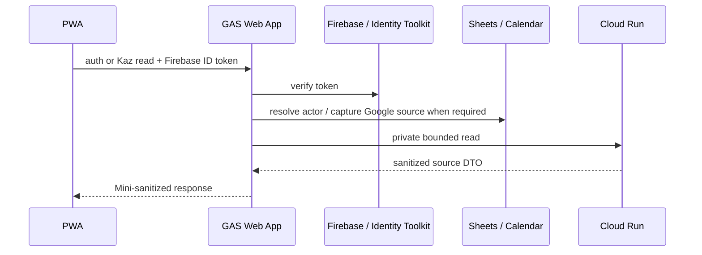
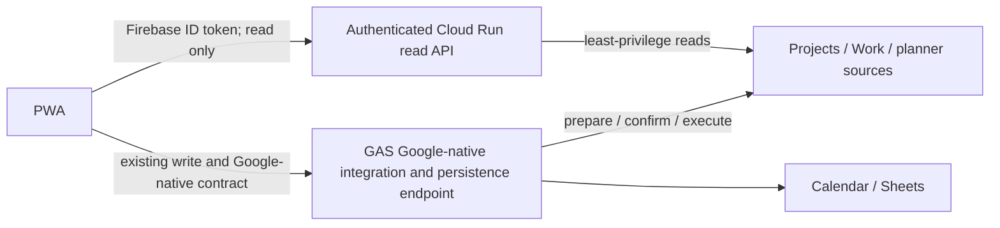
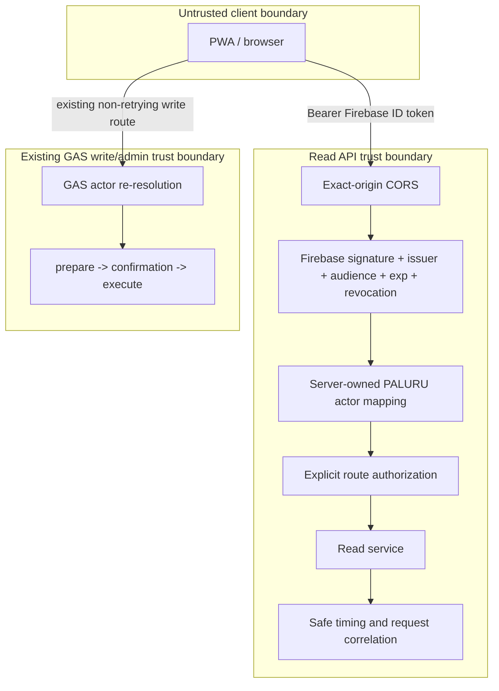

# ADR-003: PALURU / Kaz OS Transport Architecture V2

- Status: ACCEPTED FOR PHASE 1 IMPLEMENTATION — production cutover not approved
- Date: 2026-09-23
- Scope: latency-critical read transport only
- Production impact of this ADR: none

## 1. Context

PALURU currently routes authenticated reads through the Apps Script Web App:

```text
PWA -> GAS Web App -> Firebase / Sheets / Calendar / Cloud Run -> GAS sanitizer -> PWA
```

The production baseline on GAS version 172 is not suitable for a
latency-critical read path. Twenty-one observed GAS executions had a median of
4.510 seconds, p90 of 7.721 seconds, p95 of 9.392 seconds, and a maximum of
9.426 seconds. Even `auth.config.get`, which does not call Cloud Run, Notion,
Calendar, or the Decision Ledger, had a successful median of about 2.76
seconds, a 6.56 second success, and an 8 second timeout.

This evidence removes the assumption that the GAS Web App must remain the
transport for latency-critical reads. It does not establish that GAS is
unsuitable for writes, administration, or Google-native operations.

Dynamic Daily Planning V2 remains frozen at
`BLOCKED_BY_TRANSPORT_BASELINE`. This ADR does not authorize production
traffic, a timeout change, a retry change, or a write-path migration.

## 2. Decision

Use **Option B, direct authenticated Cloud Run reads**, as the PALURU read
transport target. The Projects PoC recorded a warm browser median of 1030.7
ms, p95 of 1738.6 ms, and 0 failures in 30 requests, a 75–83 percent reduction
from the observed GAS Projects baseline. This is sufficient to proceed with
Phase 1 implementation for Projects and Work, but it does not approve a
production cutover.

**GAS is not a read transit layer in the target architecture.** Latency-critical
reads go from PWA directly to Cloud Run or a separately approved Worker/BFF.
GAS remains an endpoint for Google-native integration, persistence, writes,
and administration. If a future aggregate needs a GAS-only Google source, the
read gateway may call a bounded GAS integration endpoint as an upstream; GAS
must not proxy the request onward to Cloud Run or select another read backend.

Option C remains a valid later boundary if edge policy or multi-backend
aggregation becomes necessary. It is not part of Phase 1.

## 3. Options and trade-offs

| Concern | Option A — PWA -> GAS -> Cloud Run | Option B — PWA -> authenticated Cloud Run read API | Option C — PWA -> Edge/BFF -> Cloud Run |
|---|---|---|---|
| Auth security | Existing Firebase and PALURU checks are established in GAS. Current transport instability can prevent auth completion. | Cloud Run must independently verify Firebase signature, issuer, audience, expiry, revocation/disabled state, and PALURU authorization. No trust may be placed in client role/member fields. | Edge must either verify Firebase itself or pass a cryptographically bound identity assertion to Cloud Run. Two verification boundaries increase review scope. |
| User/actor authorization | Existing Sheet-backed mapping and role/capability checks. | Must reproduce the same server-owned Firebase subject -> account -> membership -> actor mapping and fail closed. | Must define whether actor resolution belongs at edge or Cloud Run; duplicated policy is forbidden. |
| Token verification | Identity Toolkit/Firebase verification in GAS. | Firebase Admin/JWKS verification in Cloud Run. Token caching is excluded until a security review approves its bounds and revocation behavior. | Verification at edge can reduce backend work, but key rotation, revocation, and assertion signing become additional operational responsibilities. |
| CORS | Browser calls the existing Apps Script Web App. | Exact production and approved non-production origins only. No wildcard with Authorization. Preflight and exposed safe timing headers must be explicit. | Edge can centralize CORS, but a permissive edge configuration can widen the boundary. |
| Latency | Production median and tail are outside the target even for lightweight reads. | Removes the GAS Web App hop and permits one server timing domain. PoC must prove the gain. | Adds an edge hop; may improve connection reuse and policy locality, but should not be assumed faster without measurement. |
| Cold start | Apps Script startup/queue behavior is not controllable. | Cloud Run cold start remains. Min instances are not authorized by this ADR; warm and cold samples must be separated. | Worker startup is usually small, while Cloud Run cold start remains behind it. |
| Google Calendar / Sheets | Native GAS services and existing access model. | Google APIs/service account access would need explicit least-privilege design. Reads that require these sources may remain on GAS during migration. | Edge should not own Google service credentials. It would still call a trusted Google-access service or GAS. |
| Secret ownership | Script Properties plus existing Cloud Run secret references. | Cloud Run service account and Secret Manager own server secrets. PWA receives no service credential. Firebase public config is not a secret. | Edge owns only edge-specific secrets; Cloud Run and Google credentials should remain at their service boundaries. |
| Logging / observability | Browser diagnostics exist, but deployed GAS stage logs are not operationally suffix-searchable. | Correlated request ID and safe timing fields are part of the endpoint contract from its first PoC. | Edge and Cloud Run traces must share one opaque request ID and avoid duplicate or private logging. |
| Rate limiting | Apps Script platform and application checks. | Per-route limits use a verified server-side principal without logging raw identity. Limits fail closed and return a stable safe code. | Edge can absorb abuse earlier, but principal-aware limits require verified identity or a signed Cloud Run decision. |
| Replay protection | Reads are idempotent; writes retain their existing idempotency boundary. | TLS, short-lived verified token, authorization, and rate limiting are sufficient for read replay. Request IDs are correlation values, not authorization. | Same as Option B; edge assertions require nonce/expiry protections if introduced. |
| Rollback | Already deployed and understood. | Route selection is release/config based before a request. Rollback selects GAS for subsequent reads; there is no same-request fallback or dual execution. | Rollback bypasses edge and selects the previous read route. Cloud Run remains independently callable only by its authorized route. |
| Operational complexity | Lowest component count, but high and variable read latency. | Adds Cloud Run auth/actor responsibility and CORS, while removing GAS from migrated reads. | Highest component count and two runtime boundaries; justified only by measured policy or latency benefit. |

## 4. Current and target request flows

### Current



### Proposed target, after each phase passes its gate



The candidate read surface is:

- auth/session bootstrap;
- Projects;
- Work;
- TODAY;
- INBOX.

This list is a migration target, not one cutover unit. TODAY and INBOX remain
on their legacy route during Phase 1, but no new read design may use GAS as a
transit proxy. Their later migration must terminate at Cloud Run/Worker and
treat any required GAS Google operation as a bounded upstream integration.
GAS removal is explicitly not a goal.

## 5. Trust boundaries



Mandatory read-boundary rules:

- verify Firebase signature, issuer, audience, expiry, revoked state, and
  disabled-user state; any uncertainty fails closed;
- derive PALURU actor and membership on the server; client role, user ID,
  member ID, home ID, and capabilities are never authorization evidence;
- never log the raw token, token hash, raw actor identity, request/response
  payload, Calendar content, Sheet values, or Notion content;
- token verification reuse or caching requires a separate security review;
- use exact CORS origins and expose only explicitly safe timing headers;
- retain the existing write security model unchanged.

## 6. Minimal read-only PoC

### Endpoint choice

Use **Projects**, not `auth/config`, for the first PoC. `auth/config` would
measure a public lightweight response but would not exercise real Firebase
authentication, PALURU actor mapping, or route authorization.

Proposed endpoint:

```text
GET /poc/transport-v2/projects
Authorization: Bearer <Firebase ID token>
X-Paluru-Request-Id: <opaque UUID>
```

The endpoint is non-production and hidden from the production PWA route. It
must run in an isolated service or isolated non-production revision/config so
the existing `kaz-os-read-gateway` contract and production traffic cannot be
changed accidentally.

### PoC authorization

1. Verify the real Firebase ID token server-side, including revocation and
   disabled-user checks.
2. Resolve Firebase subject to the existing PALURU account and active
   membership using a read-only, least-privilege actor source.
3. Require the same Kaz owner/admin authorization as the current Mini route.
4. Reject missing, stale, revoked, disabled, unmapped, inactive, and
   unauthorized identities with stable safe codes.
5. Do not accept role, member, or home claims supplied by the PWA.

If the actor mapping still requires Sheets, the PoC service account may receive
read-only access through the Google Sheets API after a security review. The
PoC must not use a fixed test actor or bypass membership to obtain favorable
latency numbers.

### PoC client and measurements

- Use a localhost or explicitly allowlisted non-production PWA build.
- Production route selection remains GAS; no automatic fallback and no dual
  execution are added.
- Perform at least 30 authenticated reads after one separately labelled cold
  request.
- Record warm median, p90, p95, maximum, success count, and safe status code.
- Record cold samples separately; do not hide them in the warm distribution.
- Target: warm median at or below about 1 second and p95 at or below about 2
  seconds.
- Writes, Answer operations, Calendar mutation, Decision Ledger mutation, and
  production data mutation remain zero.

The PoC passes only if security assertions pass and latency meets the target.
Failure is architecture evidence; it is not resolved by increasing timeout or
retry counts.

## 7. Observability contract for the new read API

The PWA creates one opaque request ID and reuses it for the bounded read
attempt contract. The server returns and logs only allowlisted metadata:

- request ID or its safe suffix;
- route/action;
- server processing milliseconds;
- upstream milliseconds by allowlisted stage;
- terminal safe stage;
- HTTP status category and stable safe code;
- client total elapsed and attempt in browser diagnostics.

Recommended response headers:

```text
X-Paluru-Request-Id: <opaque request id>
Server-Timing: auth;dur=..., actor;dur=..., upstream;dur=..., total;dur=...
```

`Access-Control-Expose-Headers` must name these headers. No identity, token,
payload, source title/body, or private upstream value is included. The
observability acceptance gate requires an operator-visible store searchable by
request suffix; emitting a logging API call alone is insufficient.

## 8. Migration phases

### Phase 0 — Design and deterministic client repair

- Keep Dynamic Daily Planning V2 and production routing frozen.
- Fix the confirmed duplicate TODAY navigation read in an isolated commit.
- Preserve timeout, retry, write, and planner contracts.

### Phase 1 — Projects and Work direct-read foundation

- Promote the successful Projects PoC contract to `/v2/read/projects`.
- Add `/v2/read/work` using the same auth and actor boundary.
- Add a PWA `GAS` / `DIRECT_V2` adapter for Projects and Work only.
- Keep production selection at `GAS`; no deploy or cutover is authorized.
- Bound successful actor/membership reuse to a short per-instance TTL. Verify
  Firebase revocation/disabled state on every request and never cache failures.
- Measure Projects and Work independently before canary approval.

### Phase 2 — Canary and production evidence

- Approve actor-source access, CORS, rate limits, safe errors, and operational
  logging.
- Select `DIRECT_V2` only for an explicit canary cohort. `GAS` is the rollback
  selection for legacy reads, not a target-architecture transit.
- No same-request fallback and no shadow double-read of private production
  sources.

### Phase 3 — Projects, then Work canary

- Migrate one read at a time.
- Compare DTO/sanitizer behavior and freshness before expanding traffic.
- Roll back route selection immediately on auth, authorization, or correctness
  regression.

### Phase 4 — Auth/session candidate

- Move session resolution only after server-owned membership mapping and
  revoked/disabled-user handling are proven equivalent.
- Public Firebase configuration may later become a versioned static PWA asset,
  but that is independent of authenticated session resolution.

### Phase 5 — TODAY and INBOX dependency review

- Inventory Calendar capture, classification, Decision Ledger, and planning
  inputs separately.
- Keep GAS-backed reads for dependencies without an approved direct service.
- Do not split one logical response across inconsistent source snapshots.

### Phase 6 — Production acceptance

- Require real-browser auth, Projects, Work, TODAY, INBOX, diagnostics, and
  zero-write acceptance.
- Resume Dynamic Daily Planning V2 Step 9 only after the transport baseline is
  stable under the separately approved production route.

## 9. Write paths explicitly excluded

The following remain on the existing security model and are not migrated by
this ADR:

- Kaz Answer / Decision Ledger writes;
- Calendar mutation;
- registration and linking;
- Home control mutation;
- Health writes.

Write retry remains prohibited. Existing prepare/confirmation/execute,
idempotency, actor re-resolution, validation, and audit boundaries remain in
force.

## 10. Rollback strategy

Rollback is route selection, not an in-request fallback:

1. Stop new direct-read canary selection.
2. Select the previously deployed GAS read route for subsequent requests.
3. Confirm auth and the affected read with the old route.
4. Leave writes on GAS throughout; no write rollback is part of this migration.
5. Preserve request metadata long enough for safe incident comparison.

The direct service must be independently disableable. Rollback must not rotate
credentials, mutate membership data, retry a write, or execute both old and new
reads for the same user request.

## 11. Acceptance gates

- Firebase and PALURU authorization negative tests pass.
- Revoked, disabled, inactive, unmapped, and unauthorized users fail closed.
- CORS accepts only approved origins.
- Token/private-data leakage scan reports zero.
- At least 30 authenticated read samples are recorded.
- Warm median is approximately 1 second or less and p95 approximately 2
  seconds or less, or the miss is explicitly retained as architecture evidence.
- Safe request correlation is queryable in the operational log store.
- Production writes, production route changes, and Dynamic Planning V2 changes
  remain zero until separately approved.

## 12. PALURU migration template

Every PALURU read-domain migration follows this sequence:

1. Inventory the read DTO, server-owned authorization, upstreams, freshness,
   writes, retry budget, and observable safe fields.
2. Add one direct Cloud Run/Worker endpoint that fails closed and performs no
   writes. GAS may be an upstream only for an irreducibly Google-native
   operation; it may not relay the request to another read backend.
3. Add a client adapter with explicit `GAS` and `DIRECT_V2` selection. Never
   dual execute and never silently fall back within a request.
4. Prove DTO/sanitizer compatibility, source completeness, actor isolation,
   revocation/disabled handling, exact-origin CORS, rate limiting, write zero,
   and safe correlated timing.
5. Run cold and at least 30 warm authenticated samples. Compare browser total,
   server total, auth, actor, upstream, serialization, and network overhead.
6. Canary one explicit cohort. Roll back by selecting the prior transport for
   subsequent requests; do not retry or replay writes.
7. Expand only after real-browser acceptance and operational monitoring pass.

This template applies to KazOS first and then to other PALURU read domains.
Write/admin migrations require separate ADRs and safety gates.

## 13. Current decision state

This ADR authorizes local Phase 1 implementation for Projects and Work. It does
not authorize production deployment, production route cutover, main merge, or
Dynamic Daily Planning V2 traffic. The PWA ships with `GAS` selected until a
separate cutover approval. Step 9 remains `BLOCKED_BY_TRANSPORT_BASELINE`.
