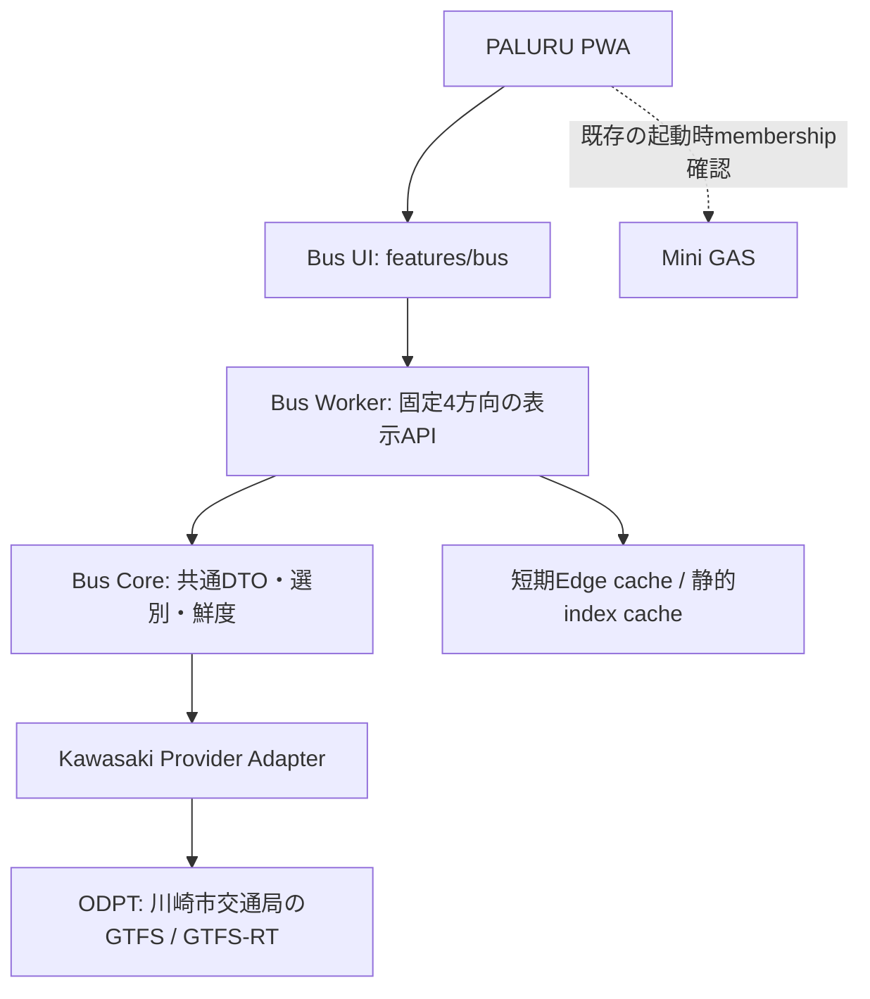

# PALURU Bus P0 設計案

## 2026-09-10 追補：Cloud Run準備・Position調査の最新境界

- Google Cloud前提（ユーザー申告）：project `paluru-bus`、region `asia-northeast1`、課金有効、Run Admin / Build / Artifact Registry / Logging API有効。CLIからのアカウント・IAM・API照合は未実施。
- Docker Desktopは利用しない。Node実HTTPでローカル検証し、`cloudbuild.yaml`でremote image buildとSecretなしの起動試験を行う。今回の許可範囲は設計・ローカルHTTP・Cloud Run構成・remote build/deploy準備まで。本番公開は別判断。
- Node 24 / Linux amd64 / standard HTTP、候補service `paluru-bus-api`。検証時は別名 `paluru-bus-api-validation`、IAM認証付き。PWAの公開URLは実Cloud Runの検証後にユーザーが変更する。旧Worker URL設定は今回変更しない。
- runtimeは `core/service.js` に共有cache/single-flight、`http/handler.js`に共通HTTP契約、`runtime/*`にNode入出力・起動・安全な計測を配置。Worker側は再exportとCache API変換のみ。位置・時刻のCore契約は変更しない。
- Staticのread/検証/indexは起動時だけ。Cloud Buildには生成済み2,616,507 bytesのP0 JSONを渡す。image内で全GTFSを取得・展開しない。
- **市バスナビ内部JSONは検証の参照専用。本番データソース候補にしない。** 今後の公開許可の調査結果によらず、このフェーズの本番AdapterはODPTのみ。
- **位置の主根拠はODPT緯度経度・timestamp・同一tripの連続観測と公式Staticの停留所座標/順序。`current_stop_sequence` / `stop_id` / statusは補助記録。sequence差で停留所間を決めない。** `content`、公式画面の位置/通過表示と時刻帯を合わせて比較する。
- 観測した溝16のStaticにはshape_idもshape距離もない。停留所を直線で結んだ図形を実際の走行経路として扱わない。GPSが停留所付近にある証拠と「区間を通過した」証拠を分ける。同名標柱・対向車線・GPS誤差・更新時刻差で一意にならない場合はnull。
- 23:25の同時取得でNavi/ODPT座標差0.90mと235.79m、23:26に0.44mを観測。内部JSONに車両観測timestampの確認済み項目がなく、同時HTTP取得だけでは同じ瞬間のGPSと証明できない。4方向の位置受入は未達。`BUS_POSITION_UI_ENABLED=false`を維持する。
- 詳細： [DATA_VALIDATIONの参照観測](PALURU_BUS_P0_DATA_VALIDATION.md)、[Cloud Run準備と手順](PALURU_BUS_P0_DEPLOYMENT.md)。以下の古いsequence中心/Worker公開手順は当時の履歴であり、本追補を優先する。

## Cloud Run移行の作業契約（2026-09-10、実装前）

最新のユーザー指定により、本番候補をCloud Runへ変更する。Worker方式は初期方式として保存し、Free CPU超過による本番NO-GOの履歴は削除しない。本節が過去のWorker前提より優先する。

- 問題/証拠：Cloudflare Freeの10msに対し、本番用moduleのremote CPUはcold 53ms・再取得34ms（DEPLOYMENT参照）。
- 方針：PWA → HTTPS / Cloud Run → 共通HTTP handler → Bus service/Core → Kawasaki Adapter → ODPT。Node.js標準HTTPを使い、HTTP pathと4方向DTOを維持する。新しいWeb framework/DB/他事業者実装は追加しない。
- 影響範囲：`bus/` のruntime/HTTP/Cache接続・コンテナ・関連試験、指定MD 3本。既存PWA/Pages、GAS、Agent、OS、Position UIは変更しない。
- 再利用：固定config、生成Static JSON、RT Adapter、Core/Normalize、fallback/stale判定、既存試験。Cache APIのWebオブジェクト変換はlegacy Worker側へ分離する。
- 配置：既存`core/`、`providers/`、`config/`、`generated/`を維持。`http/handler.js`、`runtime/server.js`/`start.js`、Dockerfileを追加。Static検証を生成処理から切り出し、起動時検証でZIP decoderを読み込まない。
- API：既存PWA互換の `GET /api/bus/arrivals`（4方向一括、queryなし）を維持。例示された `?id=` は今回は追加しない。Cloud Runのみ `GET /health` を追加。healthはStatic/設定が妥当でHTTP起動できたことを示し、ODPTの稼働保証にはしない。
- PORT：Cloud Run注入のPORT（既定8080）を0.0.0.0でlisten、TLSはCloud Run側。SIGTERMでHTTP受付を閉じる。上流timeout20秒、Cloud Run候補timeout30秒。
- Secret：本番はSecret Managerの固定versionを環境変数`ODPT_ACCESS_TOKEN`に注入する。ローカルは既存gitignore済み`.dev.vars`から起動時だけ読込。image/build args/ソース/upload context/ログ/APIに値を入れない。
- CORS：productionは`https://alleshokai-gif.github.io`のみ、その他の設定は起動時に拒否。localhostはdevelopmentのみ。CORSは認証の代替ではなく、検証Cloud RunはIAM認証付きで非公開とする。
- Cache：provider単位のservice instanceごとにRT25秒とin-flight共有、失敗backoff25秒、既存120秒の鮮度判定を維持。背景timerで定期fetchしない。複数Cloud Run instance間では共有されないことを明記する。初期候補は1 CPU / 512MiB / concurrency8 / min0 / max1（確定前にproject/課金/region照合）。max1は厳密な全球重複ゼロの保証ではない。
- 性能：Static read/validation/indexはprocess起動時だけ。既存service indexを再利用。移行と大きな索引変更を混ぜず、不要なRT全件処理・候補走査は計測結果と次の最適化課題に残す。Cloudflareの10msはCloud Runの判定に使わない。
- 観測：安全なrequest ID・status・経過時間・サイズ・memoryのみ。要求URL全文/headers/token/GTFS/RT本文はログへ出さない。Nodeのcold起動、Docker起動、Cloud Run cold startを別々に報告する。
- rollback：Cloud Run本番候補を未接続のまま検証。将来公開後は前revisionへtrafficを戻し、PWA API URLを前の承認済み値へ戻す。FreeでNO-GOのWorkerへ自動fallbackしない。今回既存公開構成は触らない。
- 受入一覧：Repository/Bus/Static生成、Node実HTTP4方向、同時要求のsingle-flight、RTあり/なし/stale/過去ETA、CORS、health、Secret未設定/Static破損の起動拒否、Docker image秘密非混入、実ブラウザカード表示、Cloud Run cold/warm/fetch/JOIN/memory/応答、実PWA/Android。実行できない項目は未確認のままとする。
- 公開ゲート：Google Cloud account/project/課金/API/IAM/Secret準備 → ローカル/コンテナ → 認証付きCloud Run検証 → ユーザー公開判断。Positionは引き続きOFF、別のPosition P1としてのみ扱う。

市バスナビ調査は別テーマとしてDATA_VALIDATIONへ記録する。公開JS/通常画面の観察と正規ODPTの限定観測を行い、内部APIは本番Adapterへ追加しない。HTMLスクレイピングは実装しない。便の同一性を証明できない観測は「同一便照合」と表現しない。

> 2026-09-10 本番準備フェーズ：StaticのWorker内取得/6時間cache/24時間上限は生成JSON同梱方式へ置換した。現在の構成・設定・計測は [DEPLOYMENT](PALURU_BUS_P0_DEPLOYMENT.md) を優先する。以下の初期実装・測定は当時の記録として保持する。

> 2026-09-10 実装着手のユーザー決定: Static 4方向・scheduled・estimated/delay・VehiclePosition結合はGO、etaMinutesは条件付きGO。以下の旧「実装前」「GO保留」や15秒pollingより、この追記を優先する。位置表示はOFF。本番deployは対象外。

## 2026-09-10 P0実装の作業契約

- 問題: 実データで確認できた4方向をPALURUで表示するAPI/UIがない。データ根拠は [検証記録9節](PALURU_BUS_P0_DATA_VALIDATION.md)。未確認の位置解釈は補わない。
- 方針: `bus/config` → Kawasaki Adapter → Bus Core → read-only Worker → `features/bus`。既存Miniは画面許可だけに使用。Busの失敗はBus内に閉じる。
- 影響範囲: Bus配下、新規UI、PWA画面登録・利用許可・静的素材登録・Build ID、Bus関連テストと文書。既存Agent/OS/データ更新契約は変更しない。
- 副作用: Bus画面を表示中だけ30秒間隔でread APIを呼ぶ。非表示・別画面・認証ロックでは停止し、復帰時に即更新。サーバーRTキャッシュは25秒。
- ロールバック: Busメニュー・画面・スクリプトの登録とallowedViews追加を戻す。Workerを未接続にする。DB移行や既存データ変更はない。既存の検証ファイル変更は保持する。
- 受入項目: 4方向各最大3便、静的の運行日/24時超/乗降順、RTによる順位入替、time優先/delayのみ/明示0/欠損/取消/過去ETA、30秒更新、hiddenと別画面で停止、復帰更新、stale/fallback/fetch error、APIキー非露出、位置DOMなし、既存78テストの回帰、ローカル実Workerとスマホ幅ブラウザ。ユーザーdeploy・実PWA受入は別段階。

### 実装時の具体値と境界

- APIは固定の `GET /api/bus/arrivals` のみ。任意stop・URL・プロキシ引数は受け付けない。公共交通だけのread APIとし、Miniの家族トークンを渡さない。CORSは許可Origin設定で絞るが認証ではない。実運用URL・Worker名・plan・公開設定は未確定で、ローカル専用設定を用意する。
- `ODPT_ACCESS_TOKEN` はWorker環境にだけ渡す。エラーは固定コード化し、上流URL・本文・例外本文を返さない。ZIPは観測済み公式配布先へ1回だけ転送を許可する。
- 静的GTFSは設定版 `20260828` を取得し、6時間キャッシュ、取得失敗時の最長利用24時間。版変更はカタログ確認後に設定を更新する。全線ZIPをメモリ内で逐次展開し、必要テーブル/対象路線/乗降stopの行だけを内部indexに残す。原本は保存・配信しない。Cache API以外のDB/KV/R2/定期ジョブを追加しない。CPU/メモリの本番制限適合は計測・plan確認の別ゲート。
- RTは観測でTU/VP両方が入っていた単一の `trip_update` FULL_DATASETを使用し、別版feedを混ぜない。乗車stopへの直接departureイベントだけを利用する。疎な更新からの遅延伝播は行わない。
- 時刻計算はepoch秒、運行日はAsia/Tokyo。前日・当日・翌日の静的便を探索し、運行calendarと例外日、乗車→降車順を確認する。0件は「検索範囲内の便なし」。scheduledはStatic、estimatedは同じdepartureのtime優先、delayだけならscheduled+delay、delay秒は差分で検算、etaMinutesは未来時刻だけ切上げ。
- RT鮮度の実装用上限: feed120秒、便timestamp180秒（測定済み周期31〜32秒に対する保守的な設定値で、安定性の実証値ではない）。古いRTは `realtime_stale`、RT未取得/項目不足は `static_fallback`、HTTP更新失敗は別の `fetch_error`。古い予測のETAは表示しない。
- 過去の予測は通常除外。ただし同一便・同一乗車stopに鮮度内の `STOPPED_AT` がある便は「予測更新待ち」としてETAをnullにし、次便判定を断定しない。過去の予定時刻しかない便は除外する。予測時刻が未来なら予定時刻が過去でも表示対象。
- 共通応答は `directions` 内に指定DTOを4件返す。各便に便識別子、路線、実際の行先、乗り場、ISO時刻、時刻根拠・鮮度状態を加える。PWAはGTFS/ODPTのフィールドを扱わずCoreの順序を維持する。
- カードは行き/帰り各2枚。系統・行先・予定発車時刻・乗り場を最大3便並べ、先発便のETA/遅れを強調する。RTなしと時刻表のみを明示。登戸は公式番号不明なので「登05のりば」、神木本町/溝口の番号は検証済み対応表から表示する。
- `BUS_POSITION_UI_ENABLED = false`。初期Adapterも `position.supported=false` と全位置値nullを返す。位置解釈の4方向検証と利用者判断を経ずに有効化しない。


- 作成日・調査日: 2026-09-06（Asia/Tokyo）
- 状態: **ユーザー判断で位置OFFのP0実装 / ローカル検証あり / 本番設定・受入待ち**
- 対象Repository: `paruru-mini`
- 調査開始時: branch `main` / HEAD `b1959d08c4b23e3ea655903542c977b7526dbf4c` / `git status --short` 出力なし
- 初回（2026-09-06）の変更: この設計書と `bus/README.md` の追加のみ
- 2026-09-07追記: 案内板UIのユーザー指定を反映。正規キーによる検証フェーズは [データ検証記録](PALURU_BUS_P0_DATA_VALIDATION.md) に分離する。
- この文書の「設計案」「提案値」はレビュー対象。既存Architecture、Agent、OSの契約を変更する決定ではない。

## 1. 目的とP0の境界

「検索せず、いつものバスが今どこまで来ているか一瞬で分かる」を最優先にする。
時刻表上の発車時刻、取得できる場合の到着/発車までの分数・遅延・停留所単位の現在位置、後続便を同じ画面で示す。

対象は次の4方向だけ。行き・帰りのグループと表示順は設定で持ち、時間帯による自動並び替えは実装しない。

| ID | グループ | 方向（ユーザー指定） |
| --- | --- | --- |
| `home_to_noborito` | 行き | 神木本町 → 登戸方面 |
| `home_to_mizonokuchi` | 行き | 神木本町 → 溝の口駅南口方面 |
| `noborito_to_home` | 帰り | 登戸 → 神木本町 |
| `mizonokuchi_to_home` | 帰り | 溝の口駅南口 → 神木本町 |

全国対応、路線検索、地図、ユーザー登録、お気に入り編集、管理画面、DB新設、通知、AI到着予測、非公式HTMLスクレイピング、東急・西武・伊予鉄対応は対象外。
既存のMini GASはリアルタイム取得ホットパスに入れない。

## 2. 結論とGO判定

**正規データ経路は存在する。採用候補は、川崎市交通局がODPTで公開するGTFS/GTFS-JPとGTFS-Realtime。**
静的だけでなく、VehiclePosition、TripUpdates、Alertの配布リソースを公開カタログで確認した。[S3]・[S4]

| 判定対象 | 現状 |
| --- | --- |
| データソースの技術選定 | **条件付きGO**。ODPT方式を採用案とする |
| 公式バスナビのHTML/画面用内部通信を継続取得 | **NO-GO**。P0で採用しない |
| P0実装開始 | **NO-GO（前提確認・設計レビュー待ちで保留）** |
| 本番公開・Acceptance | 未実施。完成判定不可 |

実装開始の保留理由は、正規トークンでZIP/Protobufを未取得で、正式ID・4方向の収録状況・実際の予測/位置フィールド・鮮度を検証できていないこと。
カタログのリソース公開だけでは、各便に全フィールドが入ることや利用条件を満たす本番運用を保証しない。

Level Aに必要な値が不足しても、許諾された範囲でLevel B/Cを表示できる設計とする。
ただし、主目的である「今どこまで来たか」が実現できない場合、その制約を設計レビューで明示する。静的表示だけをバスロケ完成と扱わない。

## 3. 既存PALURU構成と追加位置

### 3.1 現在のソースで確認したこと

| ファイル/構造 | 確認内容・Busへの意味 |
| --- | --- |
| `index.html`、`app.js`、`style.css` | 静的PWA。`app.js::switchView()` が画面を切り替える |
| `features/nurse-okan/`、`features/popio-health/` | 既存の機能UI分離。`features/bus/` が自然なPWA配置先 |
| `gas/`、`gas-health/`、`gas-family-inbox/`、`gas-Mail/` | サービス別フォルダが既にある。新しいEdge側を同階層 `bus/` に置く |
| `index.html:295` 付近 | 機能ごとの `app-view` とmount先を配置 |
| `index.html:318` 付近 | Drawerに機能への入口を配置。下部ナビはHome / Inbox / 設定 |
| `app.js:1616` 付近 | `switchView()` が許可画面を正規化し、機能へopenedイベントを送る |
| `app.js:5495` 付近 | active memberかつサーバー由来 `allowedViews` に含む画面だけを許可 |
| `gas/HomeMembershipService.js:12` 付近 | `ROLE_ALLOWED_VIEWS` が各roleの画面一覧を定義。現在 `bus` は含まれない |
| `sw.js` | app shellはnetwork first、画像はcache first。同一originの成功応答を保存する |
| `app.js:530`、`sw.js` | `updateViaCache: "none"`、`registration.update()`、`skipWaiting()`、`clients.claim()` の更新経路あり |
| `build.js` | 調査時のBuildは `v20260831-family-inbox-review-v1` |
| `docs/architecture.md`、`docs/ADR-001-agent-tool-calling.md`、`AGENTS.md` | 既存PWA・Agent/OS・認可・更新運用の境界。Busのために変更/迂回しない |

対象Repository内に `package.json`、Wrangler設定、`.openai/hosting.json` は見つからなかった。
Cloudflareアカウント側の既存Worker、zone、契約プラン、公開手順は未確認。既存設定がないと断定しない。
READMEの古い「Codexがclasp push担当」という記載より、現行AGENTSの「公開操作はユーザー本人」を優先する。

### 3.2 配置案

```text
paruru-mini/
  docs/PALURU_BUS_P0_DESIGN.md   # 今回作成する設計正本
  bus/
    README.md                  # 今回作成する作業フォルダ入口
    config/favorites.json      # 以下はGO後に作成
    core/
    providers/kawasaki/
    worker/
    test/
  features/bus/                # GO後にPWA UIを作成
```

`bus/` は新規Git repositoryにせず、既存Repository内の独立した機能フォルダとする。
`gas-bus/` とは命名しない。GASプロジェクト・Spreadsheet・clasp設定は作らない。
将来のProviderは共通インターフェースの実装追加で対応するが、P0で空のAdapter群や汎用フレームワークは作らない。

### 3.3 PWA統合案

- DrawerへBusを1項目追加し、Bus専用view/mountを設ける。既存下部ナビの構成を保つ。
- `features/bus/` に4方向共通カード、取得制御、独立したエラー表示を置く。
- `switchView()` のBus入退場通知は、Busの起動/停止だけに限定する。他機能のロード順は変えない。
- Miniの `ROLE_ALLOWED_VIEWS` へ `bus` を追加する範囲をレビューする。案は既存active memberの3role。PWAだけで許可を作らない。
- この画面許可のためのMini変更は起動時の既存membership文脈に限る。Busの各更新要求でMiniへ照会しない。
- 既存の認証状態が失効した時もBusのタイマーと通信を止める。

## 4. 公式サービス調査

### 4.1 調査方法と証拠の強さ

2026-09-06の公式Webページを閲覧し、Codexの接続ブラウザで4方向の接近情報と走行位置画面を確認した。
4方向の観測は21:29〜21:32 JST頃の一時点で、朝夕・平日・全便の網羅確認ではない。
公式ページが参照する公開JavaScriptを単発取得し、画面遷移/通信先の定義を読んだ。継続取得やスクレイパーは実装していない。

**Network調査の限界:** 接続ブラウザでNetworkログ/応答本文を取得する機能が使えず、HARは未取得。
Performance APIによる補助確認も実行環境で利用できなかった。したがって、以下のJS通信定義はソース証拠であり、Networkでの実応答・ヘッダー・更新周期の確認結果ではない。
この未確認を「公開APIなし」「位置取得不可」の証拠にはしない。

### 4.2 公式画面と通信経路

| 項目 | 確認できたこと | 未確認/採用判断 |
| --- | --- | --- |
| 公式サービス | 川崎市交通局HPから案内される `kcbn.bus-navigation.jp` の市バスナビ [S1]・[S2] | 本番PALURUへの組込み未実施 |
| 到着予測表示 | 公式ヘルプは乗車/降車停留所への予測を説明。実画面は計画時刻と「約N分で発車」を表示 | 表示された分数のうち時刻表由来/リアルタイム由来の区別を全便で検証していない |
| 何停前 | 登戸方面で「7個前の停留所を通過」、溝口方面で「1個前」等を実画面で観測 | ODPTで同じ値が直接配信されるとは限らない |
| 現在位置 | 「走行位置」で停留所配列とバス表示を観測。登05の `routeLayoutCd=2405` を遷移URLで確認 | この画面用コードをGTFS `route_id` として使わない |
| 時刻表 | 標柱→行先・曜日別/PDF時刻表の入口を確認 | P0のデータ取得はHTML/PDFではなくGTFSを使用する案 |
| 接近一覧 | `/wgsys/wgp/bus.htm` で表示。`busApproachPC.js` にフォーム送信による再表示の定義 | データ生成元がODPTと同じかは不明 |
| 補助通信 | 同JSにPOST `/wgsys/wgp/showInfoBetStops.htm`（JSON指定）、`checkRollsignNmByTransAndFrom.htm` の定義 | 公開API仕様・外部継続利用許諾として扱わない。直接再送していない |
| 路線位置画面 | `/wgsys/wgp/route.htm` へのフォーム遷移、`busRoute.js` を確認 [S11] | 位置画面のバックエンドAPI・実Network応答は未確認 |

バスナビの注意事項はリンクを原則自由とする一方、情報転用は私的使用等を超えて許可していない。[S2]
**画面が読めること、JSON応答があること、無料であることを、PALURUへの自動取得・再配信の許諾根拠にしない。**

### 4.3 4方向の公式名・系統・標柱の観測

「登戸」は公式表示 **登戸駅（生田緑地口）**、「溝の口駅南口」は公式表示 **溝口駅南口** と照合した。
次表はバスナビ実画面の観測であり、GTFS設定値の確定表ではない。[S12]〜[S16]

| 方向 | 観測した系統/のりば | 画面リンク中の `signPoleKey`（乗車→降車） |
| --- | --- | --- |
| 神木本町→登戸駅（生田緑地口） | 登05、神木本町2番 | `144818` → `145229` |
| 神木本町→溝口駅南口 | 接近一覧で溝15/17/18/19、神木本町1番 | `144817` → `145387` |
| 登戸駅（生田緑地口）→神木本町 | 登05、菅生車庫行・蔵敷経由を観測。降車は神木本町3番 | `145229` → `144819` |
| 溝口駅南口→神木本町 | 溝18は3番、溝15/16は2番を観測。降車は神木本町3番 | `145386` / `145385` → `144819` |

神木本町の時刻表の標柱一覧には、溝口駅南口方面として溝11/15/16/17/18/19、登戸駅行として登05が記載されている。
登06や第三京浜入口行等も同じ標柱一覧にあるが、**同じのりば・方面名だけで対象便に含めない**。
GTFSの同一trip内で乗車停留所の後に目的停留所があり、乗降可能なことを確認してから対象にする。

特に帰りの行先は「神木本町」行ではなく、その先の車庫・駅等である。
`trip_headsign == 神木本町` のような一致判定では抽出できない。
のりばが複数あるので、4方向=4つのstop IDとも限らない。

### 4.4 取得できる可能性と未確認を分離

| 欲しい値 | 正規取得元の候補 | 現状 |
| --- | --- | --- |
| 時刻表発車時刻・次の3便 | GTFS `stop_times` / `trips` / 運行カレンダー | 公開確認、データ本体未検証 |
| 正式停留所・系統・行先ID | GTFS `stops` / `routes` / `trips` | 未確定。バスナビのキーを代入しない |
| 推定到着/発車時刻 | GTFS-RT TripUpdates | リソース公開確認。4方向各停留所のフィールド充足は未確認 |
| 遅延分数 | 同一便・同一停留所・同一イベントの予測と予定 | 独立した遅延値の有無/精度は未確認 |
| 車両位置 | GTFS-RT VehiclePosition | リソース公開確認。timestamp/stop_sequence/current_statusの充足は未確認 |
| 何停前・停留所間 | VehiclePositionと同一tripの停留所順の照合 | 決定的な照合が成立する場合のみ。座標からの推測はしない |
| 運休・迂回 | GTFS-RT TripUpdates / Alert | 配布確認。実際の記載粒度・欠落条件は未確認 |
| 生GPS座標の地図表示 | VehiclePosition | P0で使用しない。UIへ座標は返さない |

## 5. 採用データソースと利用条件

### 5.1 公式配布リソース

静的・動的とも提供組織は川崎市交通局。提供基盤は公共交通オープンデータセンター（ODPT）。

| 種類 | 公式カタログ/リソース | 確認した配布形式 |
| --- | --- | --- |
| GTFS/GTFS-JP | [静的データセット][S3] / resource `9accdf73-5704-4f80-b10c-fd75d5edbc46` | ZIP。表示バージョン `20260701_20260828`、9月カレンダー反映済み |
| VehiclePosition | [RTデータセット][S4] / resource `058d7e67-ca78-46a3-ab6b-9d425c7018e3` | Protocol Buffers |
| TripUpdates | 同 / resource `dc831adb-163f-4383-abdc-419d88a7b5f6` | Protocol Buffers |
| Alert | 同 / resource `471825e4-d70e-4f9c-80d3-e00003ac6e91` | Protocol Buffers |

静的リソースの表示上の有効期間は2026-07-01〜2027-07-01。ただしこれを毎日の実運行保証と解釈せず、ZIP内の運行カレンダー/例外/改正を確認する。
検索結果に旧版20260801も現れたため、配布ページをライブ確認し20260828を調査時点の版として記録した。

確認できた配布パス（ホストは `https://api.odpt.org`、トークン値は記載しない）:

```text
/api/v4/files/odpt/TransportationBureau_CityOfKawasaki/AllLines.zip?date=20260828
/api/v4/gtfs/realtime/odpt_TransportationBureau_CityOfKawasaki_AllLines_vehicle
/api/v4/gtfs/realtime/odpt_TransportationBureau_CityOfKawasaki_AllLines_trip_update
/api/v4/gtfs/realtime/odpt_TransportationBureau_CityOfKawasaki_AllLines_alert
```

各配布URLは `acl:consumerKey` を要求し、開発者登録が必要と記載されている。
今回は登録・規約への同意操作・トークン探索・発行・ZIP/Protobuf取得をしていない。
3つのRTリソースには一体となったデータとの説明もあるが、実payloadが同一か別内容かは未確認。重複取得の削減は実測後に決める。

### 5.2 許諾に関する判断

| 資料 | 確認した条件 | 設計への反映 |
| --- | --- | --- |
| 基本ライセンス [S5] | 条件遵守下の成果物作成・公開を許諾。特定利用条件が優先 | 正規登録・適用条件を確認して利用する |
| 同第8条 | 再利用可能な原本・複製物・元の全部/大部分を復元できる派生データの再配布を制限 | ZIP/全線RT/静的全件JSONの公開・汎用プロキシを作らない |
| センター利用規約 [S6] | 正規アカウント、トークン保護、API呼出し制約、過大負荷の禁止 | Worker Secretへ保持。上限と共有cacheを設ける |
| 開発者ガイドライン [S7] | 動的データ生成時刻・静的取得日時の表示、鮮度/有効期限の遵守、出典/免責/開発者問合せ先 | 画面内に出典・更新日時・利用上の案内を置く |
| バスナビ注意事項 [S2] | 画面情報の転用に制約 | HTMLや画面用内部通信をデータソースにしない |

基本ライセンス末尾の特定利用条件を確認した範囲では、川崎市交通局を名指しした追加条項は見つからなかった。
ただし、実際に取得する配布物/メタデータに別の条件がないことまでは確認できていない。

**判断:** 正規APIを自動利用するための許諾経路は確認できた。一方、現段階でAcceptance 12をPASSとはしない。
利用する版の条件、30秒polling・25秒共有cacheの取得負荷、PALURU内の限定表示APIの扱い、必要な表記を確認した記録を残す。
判別できない追加条件が出た場合は取得/公開を止め、ODPTへ確認する。問い合わせはまだ送っていない。

## 6. アーキテクチャ案



| 層 | 責務 |
| --- | --- |
| Bus UI | 共通DTOだけで表示。画面の入退場、表示中の更新、Bus内のエラー処理 |
| Worker | 固定API、入力制限、CORS、timeout、取得上限、cache、秘匿、安全な診断 |
| Core | 4方向のtrip選別、運行日、便の並び、欠損/鮮度、共通DTO検証 |
| Kawasaki Adapter | GTFS/GTFS-RT解析、公式ID対応、Provider固有表現の正規化 |
| ODPT | 正規の静的/リアルタイム情報提供 |

BusはRead専用。Agent Tool、OpenAI、OS、GAS、Spreadsheetをデータ取得経路に追加しない。
モデル呼出し/Agent Tool呼出し/OS呼出しは設計上0。Bus UIに既存の個人データ・membership tokenを送信させない。

### 6.1 外部API案

`GET /v1/favorites/arrivals` の1要求で固定4方向を返す。
任意のprovider、URL、stop ID、全線列挙、任意日時検索を外部入力として受け付けない。
同じ方向で複数系統/のりばをまとめるのはサーバー側設定の責務。

内部Coreの呼出し案:

```js
getArrivals({
  provider,
  stopIds,
  destinationStopIds,
  routeIds,
  now
})
```

`destinationStopIds` は降車候補を意味し、バスの最終行先IDではない。
ユーザー例の単一 `stopId` を配列にするのは、実画面で複数のりばが存在したための設計提案。
外部APIにこの汎用引数をそのまま公開しない。

### 6.2 API公開範囲・秘密情報

- 案: Workerは公開交通情報だけを返す、PALURU表示専用の限定Read API。PWAの画面権限とは別の境界とする。
- API応答に家族の識別子、家の住所、端末token、個人プロフィールを入れない。UIラベルは正式停留所名を使う。
- ODPTキーはWorker Secret。PWA、固定JSON、HTML、ログ、Git、ブラウザへ返すURLに含めない。
- CORSの許可originは既存PALURUの実際の公開originを確認して設定する。CORSを認証と扱わない。
- 固定API以外は拒否し、全線データの中継口にしない。公開Read APIの運用上限もレビューする。
- API自体にも家族限定認証が必要なら、その方式は別の設計判断。Mini token流用や独自認証を無断導入しない。
- Cloudflare設定/公開先/Worker名/planを確認するまでは、Wrangler設定を推測で作らない。

## 7. 共通モデル案

方向カードと便を分ける。複数系統をまとめられるよう、`routeId`/`routeLabel`/最終行先/のりばは各arrivalに置く。
公式IDを未確認のまま埋めない。以下は**欠損を含む合成契約例**で、実運行データではない。

```json
{
  "schemaVersion": "bus-p0-1",
  "generatedAt": "2026-09-06T07:49:12+09:00",
  "pollAfterSeconds": 15,
  "favorites": [
    {
      "id": "home_to_noborito",
      "group": "outbound",
      "provider": "kawasaki",
      "from": { "stopIds": [], "name": "神木本町" },
      "to": { "stopIds": [], "name": "登戸駅（生田緑地口）" },
      "status": "unavailable",
      "updatedAt": null,
      "staticFetchedAt": null,
      "staticVersion": null,
      "arrivals": [],
      "error": { "code": "BUS_CONFIG_UNRESOLVED", "retryable": false }
    }
  ]
}
```

API正常時は必ず4方向分を返す。上の例は紙幅のため1方向だけ記載している。
方向の `status` は `ok` / `degraded` / `unavailable` に固定する。
一部方向が失敗した場合はHTTP 200でも各方向の状態/エラーを明示し、全方向取得不能はHTTP 503とする案。
Worker自身の制限はHTTP 429、上流の失敗は安全なBusエラーへ変換する。静的情報なしで全体成功を返さない。

arrivalの契約:

| フィールド | 意味・欠損時 |
| --- | --- |
| `tripId` / `serviceDate` / `startTime` | 公式便ID、運行日、必要な場合の開始時刻。照合できない便を同時刻だけで結合しない |
| `routeId` / `routeLabel` / `headsign` | 正式系統ID/表示名/最終行先。未取得はnull |
| `boardingStop` / `alightingStop` | 各便で確定したstop ID・名称・のりば。方向ラベルとは別 |
| `scheduledTime` / `scheduledAt` | 乗車停留所の時刻表発車時刻。表示用HH:mmと計算用日時。未取得はnull |
| `estimatedTime` / `estimatedAt` | 乗車停留所の予測時刻。`predictionKind` と対で扱う。未取得はnull |
| `predictionKind` | `arrival` / `departure` / null。到着と発車を混同しない |
| `etaMinutes` | 有効なリアルタイム予測までの分数。時刻表との差分をここへ代入しない |
| `delayMinutes` / `delayBasis` | 同一イベントで比較した遅れ、`arrival` / `departure`。比較不可はnull |
| `realtime` | 有効な予測または位置があるか。trueだけでETA/遅延ありと判断しない |
| `informationLevel` | `A` / `B` / `C`。表示できる内容から便ごとに判定 |
| `predictionUpdatedAt` / `positionUpdatedAt` / `validUntil` | 上流の生成/観測日時と使用期限。取得日時で置き換えない |
| `position` | 確定できた共通位置情報、またはnull |
| `operatingStatus` | `scheduled` / `canceled` / `unknown`。RTにいないだけで運休としない |

positionの契約:

```text
status: at_stop | approaching_stop | between_stops | unknown
stopsAway: 非負整数 | null
currentStop: { stopId, name } | null
previousStop: { stopId, name } | null
nextStop: { stopId, name } | null
updatedAt: 上流の位置観測日時 | null
```

- DTOはSchema/enumで検証する。Provider由来のHTMLや任意のフィールドをUIに通さない。
- nullと0を区別する。遅延不明を「定刻」、位置不明を「始発待ち」、データ欠落を「本日終了」に変換しない。
- `generatedAt` はAPI応答の生成日時。`updatedAt` は利用した動的データの基準日時。cache hitでも上流時刻を更新しない。
- UTCのepoch秒はAdapter内で解釈し、DTO日時は `+09:00` のISO 8601へ変換する。運行日はAsia/Tokyo。
- 同一tripの到着予測/発車予測を区別し、delayは対応する静的arrival/departureと比較する。到着しかなければ発車遅延を作らない。
- ETAはサーバーの `now` を基準に計算する。期限を過ぎた予測を0分に丸め続けない。
- 分表示の丸めはETAを切上げ、遅延の絶対値を切捨てる案。1分未満の正の遅れは「1分未満の遅れ」、負値は早い旨を示し、0は有効な比較で差が0の場合だけ。

## 8. GTFSとGTFS-RTの結合

### 8.1 固定4方向を抽出する

静的データから `agency`、`stops`、`routes`、`trips`、`stop_times`、`calendar`/`calendar_dates`、`feed_info` を確認する。[S8]

1. 正式名・位置・のりば・親子stopの関係で乗降候補を確定し、設定へ記録する。
2. 同一tripに乗車→降車の順で停留所が存在し、乗降可能な便だけを採用する。
3. 系統名だけで選別せず、経路違い・同一stop再訪・逆方向・降車先のない便を区別する。
4. 平日/土曜/休日と運行例外をサービス日で解決する。`24:xx` は前運行日の翌暦日として扱う。
5. 日付境界では前日運行分/当日/翌日の必要範囲を見る。翌朝便には「翌日」を表示する。
6. その上でGTFS-RTと便・運行日・停留所を結合する。結合不能な動的情報を別便へ付けない。

本番 `favorites.json` は4件だけ持ち、`group`、`displayOrder`、`provider`、`boardingStopIds`、`destinationStopIds`、`routeIds`、確認済みfeed versionを設定する。
ID未解決時の空配列を「全停留所/全系統」の意味にしない。起動時検証で取得対象外にする。

### 8.2 便の順序と欠落

- 先発順の上位3便を案内板に表示する。出発時刻欄は静的GTFSの予定時刻を保持し、順位は当該停留所の有効なRT予測を反映して入れ替える。予定時刻順へ固定しない。
- 並び順の基準は、当該停留所の予測発車、予測到着、静的発車の順で採用する。ただし到着を発車と称さず、静的便には「予定」の印を残す。混在時の順位は予測・予定を合わせた暫定順である。
- 位置情報から先後が分かる場合の追越し反映は、同一経路・同一対象停留所への進捗として比較できることが条件。別経路の `stopsAway` の大小だけで順位やETAを作らない。今回の実データ検証で比較可能性を確認する。
- 同時刻は予定発車時刻、公式系統ID、便IDの順で安定的に並べ、更新のたびに同順位の便を入れ替えない。
- 定刻を過ぎても、遅延してまだ乗車前の便は落とさない。候補抽出は未来の時刻表だけでなく、動的データ上の対象tripも含める。
- 通過済みと確認できた便、運休、乗降不可、対象停留所SKIPPEDは乗車候補から外す。運休/迂回の事実は小さく表示する。
- 更新を受け取らないことと定刻運行は同義ではない。未発車・未観測・配信失敗は区別する。[S9]
- 現在便を先頭に、次便、次々便まで最大3件を表示。残りが2便/1便ならその数だけ表示し、架空の便を埋めない。
- 有効な運行カレンダーと探索範囲で確定できた場合だけ「本日終了」「対象便なし」。取得失敗は別の状態。

### 8.3 停留所単位の位置

VehiclePositionの便対応、`current_stop_sequence`/`stop_id`、`current_status` を、同じtripの停留所配列に照合する。[S10]

- `STOPPED_AT` はその停留所、`INCOMING_AT` はその停留所へ接近、`IN_TRANSIT_TO` はその停留所へ移動中。
- sequenceの数字の引き算ではなく、並べた停留所のindexで数える。連番とは限らない。
- `stopsAway` は、停留所上ならその停留所から乗車停留所までの区間数、移動中なら確定した直前停留所からの区間数とする案。乗車停留所上は0、直前停留所→乗車停留所間は1。
- この値はバスナビの「N個前を通過」と同じ意味とは断定しない。UI説明/テストで意味を固定する。
- 迂回・停留所スキップ等で隣接関係が確定しない場合、確定した停留所名だけを出し、区間/停留所数はnullにする。
- 座標しかない場合、距離から便・停留所・進捗を推測しない。P0の停留所模式図は出さない。
- バスアイコンは確定した停留所点/区間に置く。区間中央は模式表現であり、走行距離50%を意味しない。経過時間でアニメーションさせない。

## 9. 情報レベルとUI

| レベル | 条件 | 表示 |
| --- | --- | --- |
| A | 有効なリアルタイム予測＋停留所位置 | 時刻表便、到着/発車までN分、取得可能な遅延、停留所模式図 |
| B | 有効な予測あり、停留所位置なし | 時刻表便、到着/発車までN分、取得可能な遅延 |
| C | 有効な静的時刻表のみ、または予測なし | `HH:mm 予定`。リアルタイムETAを出さない |

スマホ向けのカードを4方向で共用する。カード内は電車の案内板をイメージし、**系統・行き先・出発時刻・のりば**を先発順に最大3行表示する。各行の補助表示に、取得できた予測・遅延を載せる。

一番下の位置欄は、常に**現在の1位の便だけ**を示す。3つ前→2つ前→1つ前→当停留所を基本とし、実際の乗車停留所名を表示する。遠い位置は「4停以上前」など確認できた範囲で示す。
順位と最下段の位置は同じデータ更新で切り替える。順位が入れ替わった後に旧1位の位置を残さない。新1位の位置が不明なら「先発便の位置情報なし」と表示し、2位の位置を代用しない。

位置だけ取得できる便はC相当の時刻表行として表示し、その便が1位なら最下段に位置を出せる。新しいLevelを増やさず、予測のない「あとN分」は作らない。3便がA/B/C混在しても同じカードを使う。

```text
行き
神木本町 → 登戸駅（生田緑地口）

系統   行き先       出発時刻  のりば
登05   登戸駅         07:54    2番
       あと6分で到着・到着3分遅れ
登05   登戸駅         08:06    2番
       あと18分で到着
登05   登戸駅         08:20    2番
       予定

先発の場所：1つ前から神木本町へ移動中
                       バス
○──────○──────○──────★
3つ前   2つ前   1つ前   神木本町

データ更新 07:49 / 提供 ODPT・川崎市交通局
```

上は合成例。表示時刻から実際の現在位置を生成しない。
帰りは特に「降車先：神木本町」と「バスの最終行先」を分け、各便ののりばを目立たせる。
画面幅360/390px、文字拡大、長い行先で横スクロール/文字切れを起こさない。操作は高さ48px以上・文字16px以上を目安とする。
色・バスアイコンだけに頼らず、位置を短いテキストでも表す。

## 10. 更新・キャッシュ・障害の設計案

### 10.1 更新条件

更新を許可する条件は **Bus view表示中 AND document非hidden AND active member**。

- 入場/再表示で即時refresh。通常は30秒間隔。2026-09-10のユーザー決定を採用する。
- `document.hidden`、Bus以外への遷移、`pagehide`、認証失効でtimer停止・AbortControllerで通信を中断。
- `pageshow`/再入場は状態を再評価し、timerを重複登録しない。
- 同時に1つのfetchだけ。遅い応答に次の要求を重ねない。離れた画面への古い応答を適用しない。
- エラー時は即時の無制限再試行をせず、30秒間隔を維持する。Workerも失敗後25秒は再取得を抑制する。
- 実測feed更新は約31〜32秒。APIの `pollAfterSeconds` は30秒。毎回内容が変わる保証はない。

### 10.2 Cache

| 対象 | 提案値 | 守る条件 |
| --- | --- | --- |
| 静的GTFS・停留所index | 更新確認6時間、再利用上限24時間 | feed/サービス日の有効期間と配布条件を優先 |
| TripUpdates/VehiclePosition | 25秒 | 上流の観測時刻・有効期限も検査。TTLだけで鮮度を決めない |
| PWAへのAPI応答 | HTTP `Cache-Control: no-store` | ブラウザ/SWに過去のRTを残さない |
| PWAのHTML/JS/CSS | 既存network first | Busファイルをapp shellの更新対象へ追加 |
| 画像 | 既存cache first | Busのためだけの版数変更で解決扱いしない |

RTの古さを許容する最大秒数は、配信timestamp/有効期限/公式更新周期を実データで測ってから設定する。未設定ならリアルタイム表示を有効化しない。
APIの生成時刻やcache保存時刻で古い観測を新しく見せない。

EdgeではProvider/feed単位で取得を共用し、4方向のために同じ全線feedを4回取得しない。
原本と正規化indexはWorker内部cacheに留める。P0でDB/KV/D1/R2や定期収集基盤は追加しない。
Cache APIはデータセンター単位であり、全世界1回の取得を保証しない。[S17]
同一実行環境内の同時取得まとめとcache miss時の上限を設けるが、全POPを跨ぐ厳密な回数保証とは区別する。

**静的初回取得の検証ゲート:** ZIPサイズ・展開CPU・メモリ・indexサイズを測る。
更新時は新しい完全なindexを検証後に切り替え、旧版とRTを混ぜない。
metadataから最新版を取得する具体的API/認証は正規登録後に確認する。20260828を永久固定しない。
Cold startで制限を超える場合はDBや常駐サービスを無断導入せず、取得方式の設計提案へ戻す。[S18]

### 10.3 通信量と計測

- 1画面の1周期は固定4方向をまとめたAPI要求1回。
- upstream cache miss時はRT最大3要求、静的更新はmetadata+ZIPの最大2要求案。1応答内で即時retryしない。
- 同一payloadで3種類を満たすことが実証できた場合はRT要求数を減らす。
- UI timeoutは10秒、Worker全体deadlineは8秒を初期提案値とし、実測してレビューする。超過を成功扱いしない。
- 成功/失敗双方でupstream回数、cache hit、fetch/decode/join/totalの所要時間、応答サイズを測る。
- ログはBuild、コード、stage、reason、件数、サイズ、所要時間、相関ID末尾のみ。キー付きURL・元レスポンス・個人情報を出さない。
- 新しい恒久台帳は作らない。ログを運用者が実際に取得/検索できることは公開後の別受入項目。

### 10.4 SW・障害隔離

現状SWは同一originのGET成功応答をcacheへ保存する。
Workerが別originなら現在の同一origin制限で保存されないが、Bus APIは将来同一origin経由になっても**SW cache対象から明示除外**する案とする。
Bus APIをapp shell JSONの一種として保存しない。全画面のキャッシュ方針は変更しない。

| 状態 | 表示/処理 |
| --- | --- |
| RT失敗・有効な静的あり | 「リアルタイム取得失敗／時刻表のみ」。予測・位置を消し、予定と失敗を併記 |
| RT未提供・有効な静的あり | 「時刻表のみ」。通信失敗とは分ける |
| 静的も取得不可/期限切れ | 「取得できません」。空の便を成功扱いしない |
| 1方向だけ正規化失敗 | 当該方向をエラーとし、他3方向は独立して表示 |
| 429/上流timeout | Bus内で表示し、上限付きbackoff |
| オフライン | 期限切れのRTを表示しない。復帰時の再取得を待つ |

静的表示への縮退はこの設計に明記した挙動として実装する。無表示のfallback、GAS/legacy Router/HTMLへのfallbackは禁止。
共有HomeメッセージやAgent状態をBusの障害で書き換えない。
主なエラーenum案は `BUS_CONFIG_UNRESOLVED`、`BUS_UPSTREAM_AUTH`、`BUS_UPSTREAM_RATE_LIMITED`、`BUS_UPSTREAM_TIMEOUT`、`BUS_FEED_INVALID`、`BUS_STATIC_EXPIRED`、`BUS_REALTIME_STALE`。

## 11. 実装前の変更記録

| 項目 | 記録 |
| --- | --- |
| 問題/目的 | 固定4方向の普段のバスを検索なしで確認したい |
| 原因 | 障害修正ではなく新機能。既存PALURUにBus画面・取得基盤がない |
| 方針 | 正規GTFS/GTFS-RT＋独立Worker＋共通DTO＋PWA機能UI |
| 影響範囲案 | `bus/`、`features/bus/`、入口/画面許可/SW更新の最小変更、対応テスト |
| 主な副作用 | 新規Edge通信・利用量、Drawer1項目、role別許可の追加、PWA配布資産の追加 |
| API/データ構造 | Bus専用DTO/APIの新設案。既存Inbox/Health/Agent Trace schemaの変更なし |
| ロールバック | ユーザー操作でBus入口/許可追加を戻し、Workerの受付を止める。既存DB移行やデータ削除は伴わない |
| 実機試験 | 次節。ユーザー本人のdeploy後に既存機能も含めて確認 |

今回の設計文書追加は上記の実装を行うものではない。
Build変更、GAS実行、Spreadsheet更新、commit/push、Cloudflare設定、デプロイ、PWA公開は行わない。

## 12. Acceptanceと現状

| # | 受入条件 | GO後の確認方法 | 現状 |
| --- | --- | --- | --- |
| 1 | PALURUからBusを開ける | role別Drawer/直接遷移/既存authの実ブラウザ試験 | 未実装 |
| 2 | 4方向が表示される | 行き2・帰り2、正式名/のりば確認 | 公式4方向を観測、PALURU未実装 |
| 3 | 次に利用する便が表示される | 公式時刻表・運行日・RTと各方向を照合 | GTFS本体未検証 |
| 4 | 取得可能ならあとN分 | arrival/departure、欠損、期限切れを含め照合 | TripUpdates公開確認のみ |
| 5 | 取得可能なら遅延 | 同じイベントの予定/予測で照合。未知≠0 | 未検証 |
| 6 | 先発便の位置を最下段に表示 | 3つ前/2つ前/1つ前/当停留所、区間、sequence欠番、順位切替時の便一致を照合 | UI指定を設計に反映、GTFS-RT未検証 |
| 7 | 案内板に先発順の最大3便 | 系統/行き先/予定出発時刻/のりば、RTによる順位逆転、残り2便/終バス/翌日 | 未実装 |
| 8 | 約30秒更新 | 実Networkでinterval、上流timestamp、要求数計測 | 未実装 |
| 9 | 非表示中polling停止 | 別view、別タブ、バックグラウンド、BFCache復帰 | 未実装 |
| 10 | 障害が他機能へ波及しない | timeout/429/不正feed時もHome・Inbox・Health等を操作 | 未実装 |
| 11 | RT経路にGASなし | Bus更新中のNetwork/Worker診断でGAS要求0を確認 | 設計のみ |
| 12 | 公式取得と利用条件に問題なし | 正規登録、適用条件、取得頻度、再配布境界、表記を確認 | 条件付き。PASS未判定 |

追加の試験項目:

- 祝日/例外運行、改正境界、24時超、同時刻の別便、同一停留所再訪。
- 静的に存在する遅延便を定刻経過だけで消さない。RTから消えた便を運休としない。
- TripUpdatesだけ/位置だけ/両方/両方なし、古いentity timestamp、新旧feed不一致。
- 運休・乗車停留所スキップ・迂回を、正常な乗車候補として表示しない。
- 停留所配列から模式図を生成し、位置を時刻や座標近接だけで補完しない。
- 同時端末/連続入退場/手動更新でも1画面の多重fetchを作らない。
- response/APIログ/ブラウザNetworkにODPTキーやPALURU tokenが漏れない。
- APIの任意provider/URL/stop入力を拒否し、原本ZIP/全線RTが外部へ返らない。
- Bus APIのSW保存を拒否。HTML/JS/CSS更新、オフライン、Build表示、旧cache削除を確認。
- Android実PWAで画面幅/文字拡大/復帰後更新/のりば視認性を確認。

実装時は変更前後の既存テスト、追加Core/Adapterテスト、対象Repository全体のテストを実施する。
主な既存回帰対象は `test/pwa-allowed-views.test.js`、`test/membership-context.test.js`、`test/pwa-auth-gate.test.js`、`test/pwa-update.test.js` とHome/Inbox/Health系。
今回コード変更はなく、構文・既存/全体テスト・実PWA受入は未実施。文書の整合性/差分確認だけを実施する。
**ローカルテストPASS、ユーザー本人によるdeploy、実ブラウザ/実PWA受入、ユーザー確認を分離して記録する。**

## 13. 設計レビュー項目と次の手順

### 設計レビューで決めること

1. `bus/` + `features/bus/` + 独立Workerの配置。
2. 方向単位で複数系統/のりばをまとめ、各便に正式系統/行先/のりばを表示する契約。
3. 3roleの既存画面許可への追加と、公開交通情報だけを返す限定Worker APIの境界。
4. Level混在、位置だけ/時刻表だけの表示、明示的な縮退、stopsAwayの意味。
5. タイムアウト/TTL/要求数の提案値。実データ計測で変更する際の確認。

### 実装開始までのゲート

| Gate | 必要な証拠 | 現状 |
| --- | --- | --- |
| G1 | ユーザーの設計レビュー | 待ち |
| G2 | ユーザー本人のODPT登録/適用規約確認、正規キーの安全な設定 | 未実施 |
| G3 | GTFS/GTFS-RT単発取得・Decode、4方向のID/系統/のりば/運行日結合表 | 未実施 |
| G4 | 予測/位置のフィールド充足と鮮度、上流更新頻度・利用上限の確認 | 未実施 |
| G5 | Worker実行制約内のZIP/index処理、既存Cloudflare設定と公開先確認 | 未実施 |

G1〜G5の結果をこの文書へ追記し、GOなら、設定→Adapter/Core→Worker→PWA→回帰試験の順で実装する。
合成fixtureでローカル試験を行い、ライセンスに反する実データfixtureの公開を避ける。
その後にユーザー本人がWorker/必要なMini変更/PWAを公開し、実機Acceptanceを実施する。
契約上許可されない取得方法しか残らない場合はNO-GOを維持し、HTMLスクレイピングへ切り替えない。

## 14. 調査上の未確認・取得できなかったもの

- ブラウザNetworkのHAR/response headers/body、公式画面の正確な自動更新周期。
- 正規トークンを用いたODPTデータ本体、4方向のGTFS ID、RT coverage、当該配布版の追加条件。
- ODPT側の具体的rate limit、feedの実際の生成間隔/遅延、3つのRT URL間のpayload重複。
- 公開CKANの `package_show` メタデータ取得は、この環境で期待した `result` オブジェクトを得られなかった。カタログの不存在の証拠にはせず、ブラウザで公開ページを確認した。
- 既存Cloudflareアカウント/Worker/公開origin、ODPTアカウントの有無。秘密情報は探索していない。
- Android、実PALURU、Workerからの実API取得、終日安定性、既存全機能への実機回帰。

## 15. 出典

Web/カタログ/規約は2026-09-06閲覧。JavaScriptは公開画面で参照を確認したものを単発GET。
検索キャッシュよりライブ画面を優先した。ページの記載は実payloadの検証を代替しない。

[S1]: https://www.city.kawasaki.jp/820/page/0000039449.html "川崎市交通局: 市バスナビの便利な使い方"
[S2]: https://kcbn.bus-navigation.jp/wgsys/wgp/notes.htm?locale=ja "市バスナビ: 注意事項・免責事項"
[S3]: https://ckan.odpt.org/dataset/transportation_bureau_city_of_kawasaki_all_lines "川崎市バス: GTFS/GTFS-JP"
[S4]: https://ckan.odpt.org/dataset/odpt_transportation_bureau_city_of_kawasaki_all_lines "川崎市バス: リアルタイム情報"
[S5]: https://developer.odpt.org/terms/data_basic_license.html "ODPT基本ライセンス・特定利用条件"
[S6]: https://developer.odpt.org/terms/center_use_rules.html "ODPT利用規約"
[S7]: https://developer.odpt.org/terms/data_basic_use_guideline.html "ODPT開発者ガイドライン"
[S8]: https://gtfs.org/documentation/schedule/reference/ "GTFS Schedule Reference"
[S9]: https://gtfs.org/documentation/realtime/feed-entities/trip-updates/ "GTFS Trip Updates"
[S10]: https://gtfs.org/documentation/realtime/feed-entities/vehicle-positions/ "GTFS Vehicle Positions"
[S11]: https://kcbn.bus-navigation.jp/wgsys/js/wgp/busRoute.js "市バスナビの位置画面用公開JavaScript"
[S12]: https://kcbn.bus-navigation.jp/wgsys/wgp/search.htm?existYn=N&from=%E7%A5%9E%E6%9C%A8%E6%9C%AC%E7%94%BA&fromType=1&locale=ja&mapFlag=false&nextDiagramFlag=0&tabName=timetableSignpoleTab "神木本町: 時刻表の標柱一覧"
[S13]: https://kcbn.bus-navigation.jp/wgsys/wgp/bus.htm?from=%E7%A5%9E%E6%9C%A8%E6%9C%AC%E7%94%BA&to=%E7%99%BB%E6%88%B8%E9%A7%85%EF%BC%88%E7%94%9F%E7%94%B0%E7%B7%91%E5%9C%B0%E5%8F%A3%EF%BC%89&fromType=1&locale=ja&mapFlag=false&nextDiagramFlag=0&existYn=N "神木本町から登戸"
[S14]: https://kcbn.bus-navigation.jp/wgsys/wgp/bus.htm?from=%E7%A5%9E%E6%9C%A8%E6%9C%AC%E7%94%BA&to=%E6%BA%9D%E5%8F%A3%E9%A7%85%E5%8D%97%E5%8F%A3&fromType=1&locale=ja&mapFlag=false&nextDiagramFlag=0&existYn=N "神木本町から溝口駅南口"
[S15]: https://kcbn.bus-navigation.jp/wgsys/wgp/bus.htm?from=%E7%99%BB%E6%88%B8%E9%A7%85%EF%BC%88%E7%94%9F%E7%94%B0%E7%B7%91%E5%9C%B0%E5%8F%A3%EF%BC%89&to=%E7%A5%9E%E6%9C%A8%E6%9C%AC%E7%94%BA&fromType=1&locale=ja&mapFlag=false&nextDiagramFlag=0&existYn=N "登戸から神木本町"
[S16]: https://kcbn.bus-navigation.jp/wgsys/wgp/bus.htm?from=%E6%BA%9D%E5%8F%A3%E9%A7%85%E5%8D%97%E5%8F%A3&to=%E7%A5%9E%E6%9C%A8%E6%9C%AC%E7%94%BA&fromType=1&locale=ja&mapFlag=false&nextDiagramFlag=0&existYn=N "溝口駅南口から神木本町"
[S17]: https://developers.cloudflare.com/workers/runtime-apis/cache/ "Cloudflare Workers Cache API"
[S18]: https://developers.cloudflare.com/workers/platform/limits/ "Cloudflare Workers Limits"

追加の確認元:

- [川崎市交通局の公開データ一覧](https://ckan.odpt.org/organization/transportation_bureau_city_of_kawasaki)
- [静的GTFSの調査時点リソース](https://ckan.odpt.org/dataset/transportation_bureau_city_of_kawasaki_all_lines/resource/9accdf73-5704-4f80-b10c-fd75d5edbc46)
- [VehiclePositionリソース](https://ckan.odpt.org/dataset/odpt_transportation_bureau_city_of_kawasaki_all_lines/resource/058d7e67-ca78-46a3-ab6b-9d425c7018e3)
- [TripUpdatesリソース](https://ckan.odpt.org/dataset/odpt_transportation_bureau_city_of_kawasaki_all_lines/resource/dc831adb-163f-4383-abdc-419d88a7b5f6)
- [Alertリソース](https://ckan.odpt.org/dataset/odpt_transportation_bureau_city_of_kawasaki_all_lines/resource/471825e4-d70e-4f9c-80d3-e00003ac6e91)
- [公式ヘルプ](https://kcbn.bus-navigation.jp/wgsys/wgp/help.htm?locale=ja)
- [接近画面の公開JavaScript](https://kcbn.bus-navigation.jp/wgsys/js/wgp/busApproachPC.js)
- [GTFS-Realtime Reference](https://gtfs.org/documentation/realtime/reference/)

## 16. 追加調査: 実データで確認する4点（2026-09-07）

- 今回の調査開始時: HEAD `d9ec7604d31fcd1e9dc349c65241d503106e485b`、作業ツリーclean。
- 範囲: 正式ID、4方向の予測coverage、停留所間位置、時刻4項目の成立条件。P0実装の開始承認とは扱わない。
- 実データ取得: 未実施。`ODPT_CONSUMER_KEY` / `ODPT_ACCESS_TOKEN` / `ODPT_API_KEY` のProcess/User環境変数は未設定。確認したのは有無のみで、他の保管先にキーがないとは断定しない。
- 正規キーの取得状況/安全な保管先をユーザーへ確認中。キーの値をチャットに貼り付ける必要はない。

### 16.1 正式stop IDと乗り場差分

GTFS `stop_id` は引き続き未確定。4.3節の `signPoleKey` は、2026-09-06に公式バスナビ画面で確認した標柱キーであり、GTFS IDとして使わない。

| 確認する停留所・乗り場 | 前回確認した用途 | GTFSでの確定状況 |
| --- | --- | --- |
| 神木本町1番 | 溝口駅南口方面へ乗車 | 未取得 |
| 神木本町2番 | 登戸駅（生田緑地口）方面へ乗車 | 未取得 |
| 神木本町3番 | 両駅からの帰りで降車 | 未取得 |
| 登戸駅（生田緑地口） | 登05の乗降。画面で乗り場番号は確認できていない | 未取得 |
| 溝口駅南口2番 | 帰りの溝15/16を観測 | 未取得 |
| 溝口駅南口3番 | 帰りの溝18を観測 | 未取得 |
| 溝口駅南口の到着側標柱 | 神木本町から降車。上の2/3番と別キー | 未取得 |

ZIP入手後は名称・標柱/親stop・座標・tripの停留所順を照合し、用途ごとにGTFS IDを記録する。
上表は全系統/全標柱の網羅表ではない。未知の番号は空欄のまま扱う。

### 16.2 4方向にTripUpdatesが来るか

| 方向 | 対象tripとの一致 | 乗車stopの予測 | 更新の連続性 |
| --- | --- | --- | --- |
| 神木本町→登戸 | 未観測 | 未観測 | 未観測 |
| 神木本町→溝口駅南口 | 未観測 | 未観測 | 未観測 |
| 登戸→神木本町 | 未観測 | 未観測 | 未観測 |
| 溝口駅南口→神木本町 | 未観測 | 未観測 | 未観測 |

判定はHTTP 200や全線のentity件数だけでは行わない。
各方向について「正しい運行日の乗車→降車を満たすtrip」「乗車stopで使える予測」「新しい観測時刻」を別々に数える。
乗車stopに直接値がある場合と、GTFS仕様に沿う遅延伝播で得られる場合も分けて記録する。
NO_DATA、対象停留所SKIPPED、運休、対象便の運行時間外、配信失敗を区別する。
単一snapshotで0件でも「未対応」と断定せず、対象便が接近する時間帯の複数snapshotで確認する。未観測の欄に0を入れない。

### 16.3 VehiclePositionから停留所間を再現できるか

実データでの成立は未確認。必要な結合は次のとおり。

```text
VehiclePositionの便識別
  → 同一の運行日・便インスタンス
  → 静的GTFSの停留所順
  → current_stop_sequence / stop_id / current_status
  → 停留所上、接近中、または確定した前停留所→次停留所
```

TripUpdatesとの結合で `FeedEntity.id` 同士が同じと仮定しない。
便を一意にできない場合や、位置観測が古い場合は区間表示不可とする。
sequenceがなくstop IDだけの場合は、当該stop名が分かることと「停車中/停留所間」が分かることを分ける。
実データ検証では同じ便の複数snapshotで位置の進行を追い、GTFSの順序と公式画面を照合する。座標の近さやETAから区間を作らない。

### 16.4 TripUpdatesだけで4項目が揃うか

**仕様上の回答: 通常の時刻表便について、TripUpdates単独では4項目が必ず揃うとはいえない。静的GTFSと現在時刻が必要。**
現行GTFS-RT仕様の `scheduled_time` はNEW/REPLACEMENT/DUPLICATED用で、通常のSCHEDULED便へ一般化できない。
`time` と `delay` が両方入れば予定時刻を逆算できる場合はあるが、正式時刻表の正本の代わりにはしない。
川崎市バスで実際にどの項目が埋まるかは未観測。[GTFS-RT StopTimeEvent](https://gtfs.org/documentation/realtime/reference/#message-stoptimeevent)

以下の式は同一便・同一stop・同一イベント（arrivalまたはdeparture）でだけ使う。時刻は計算時epoch秒。

| 項目 | 取得/計算条件 |
| --- | --- |
| scheduled | 静的GTFSの当該イベント時刻を運行日と結合 |
| estimated | 有効なRTのtime。timeがなくdelayだけならscheduled + delay |
| delay | estimated − scheduled。配信delayもあれば整合性を検査 |
| etaMinutes | 有効な未来のestimatedに対し `ceil((estimated − now) / 60)` |

timeだけなら予定/遅延に静的GTFSが必要。delayだけなら予測/ETAにも静的GTFSが必要。両方なければ予測はnull。
画面の「時刻表発車」と比較する遅延はdepartureを用い、arrivalしかない場合は別の到着予定と比較して「到着の遅れ」と示す。
Protobufのフィールド存在情報を残し、欠損をデコーダーの既定値0と取り違えない。
過去イベントや期限切れのtimeを「あと0分」として残さない。

### 16.5 今回の到達点

1〜3は正規キー/実データ待ち、4は一般仕様の成立条件まで確認した。
本節の追加は検証方法と未確認状態の記録であり、4方向のRT利用可能性やLevel Aの実証ではない。
実装・本番API取得・実機試験・デプロイは行っていない。P0実装開始の保留は継続する。
