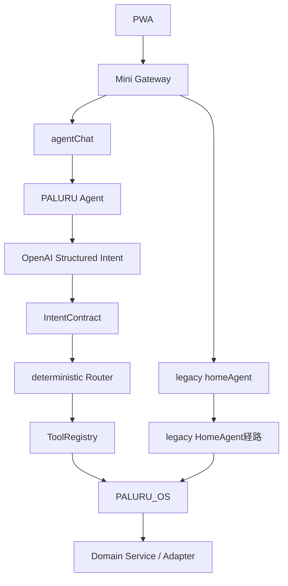
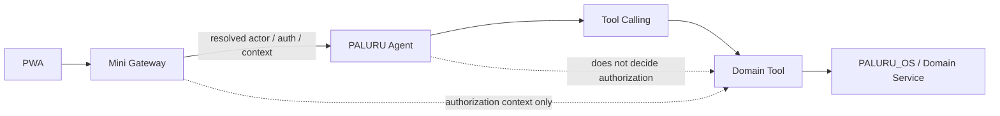
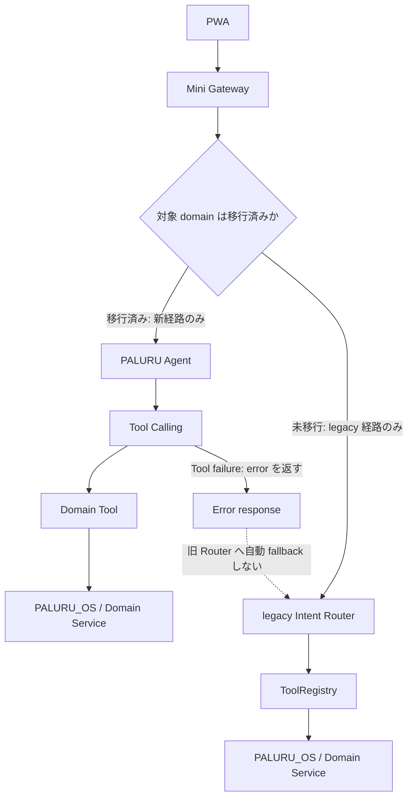

# Architecture

## 全体構成

PALURU Miniは、GitHub Pagesで配信するPWA、GAS Web App、Spreadsheet、OpenAI API、Google Calendarで構成します。

```text
PWA / GitHub Pages
        ↓
GAS Web App
        ↓
Spreadsheet 01_Inbox
        ↓
OpenAI Responses API
        ↓
Google Calendar
```

SignageはPALURUのInboxではなくGoogleカレンダーを参照します。

## データ正本

- 未処理の作業: PALURU Inbox
- 確定した予定: Googleカレンダー
- 処理済み履歴: Spreadsheetのcompleted行
- Signage表示: Googleカレンダー

eventはGoogleカレンダー登録成功後のみcompletedへ移動します。登録失敗時はInboxに残します。

## 外部連携

### OpenAI

GASからOpenAI Responses APIを呼びます。APIキーはScript Propertiesの `OPENAI_API_KEY` に保存します。

### Google Calendar

GASからCalendarAppで登録します。ファミリーカレンダーIDはScript Propertiesの `PALURU_FAMILY_CALENDAR_ID` に保存します。Calendar IDはフロントへ返しません。

## 状態遷移

### Inbox item

```text
inbox → completed
inbox → deleted
```

eventはGoogleカレンダー登録成功時のみ `completed` へ移動します。

### calendarSyncStatus

```text
not_required
pending
synced
failed
update_required
deleted
```

v1.0では新規登録と登録済み表示を主導線とします。GoogleカレンダーからPALURUへの逆同期は未実装です。

## PWA更新方針

- navigation / HTML / JS / CSS / manifest: network first
- 画像・キャラクター素材: cache first
- `updateViaCache: "none"`
- 起動時に `registration.update()`
- install時に `skipWaiting()`
- activate時に `clients.claim()`
- 古いcacheはactivateで削除
- controllerchange時は一度だけreload

## Current Architecture

本章は、Agent の相談・操作経路における現行構成を示します。前述の全体構成、データ正本、外部連携および PWA 更新方針は引き続き有効です。

`agentChat` と legacy `homeAgent` は並存しています。`agentChat` は Structured Intent を生成してから決定論的にルーティングする経路であり、`homeAgent` は legacy HomeAgent 経路として維持されています。



## Target Architecture

ADR-001 に基づく移行先の相談・操作経路は次のとおりです。

- Agent は自然言語理解、Tool 選択、multi-tool orchestration、結果統合、follow-up を担当する。
- actor / auth / context は Mini Gateway 側で解決する。Agent は authorization を決定しない。
- business rule / validation / cache / rate limit / idempotency / audit / write safety は、Domain Tool と PALURU_OS / Domain Service 側の決定論コードに残す。



## Read / Write Architecture

Read Tool は Agent から直接利用できます。ただし、Read 結果の business rule、validation、authorization、cache、rate limit、audit は Domain Tool と PALURU_OS / Domain Service が決定論的に実施します。

Write は、必ず次の三段階で実施します。

```text
prepare → confirmation → execute
```

- `prepare` は書込み候補と確認に必要な情報を生成する。
- `confirmation` は利用者の明示確認を記録する。
- `execute` は confirmation 後に actor / auth / context を再検証し、Tool / OS 側で validation、idempotency、write safety、audit を実施してから実行する。
- Agent の Tool Calling だけで実操作を完結させない。
- 既存 Aircon の `prepare / confirm / execute` は、この安全境界の実装資産として再利用する。

## Migration Architecture

Big Bang での置換は行いません。domain ごとに新旧経路を切り替え、未移行 domain のみ legacy Router を利用します。同一 request で新旧経路を二重実行しません。

Tool の失敗時は失敗を呼出し元へ返します。旧 Router への自動 fallback は行いません。



## Phase 1

Phase 1 は次の順序で導入範囲を限定します。

1. Weather read
2. Calendar read
3. Home read
4. Calendar + Weather multi-tool
5. Home `prepareAction`

`prepareAction` 後の confirmation と execute は、既存 Aircon の `prepare / confirm / execute` を再利用する前提で、別途設計・検証します。

## Deferred Domains

次の domain は Phase 1 の対象外とし、legacy 経路を維持します。

- Health
- Finance
- Energy
- School / Lunch などの legacy domain
