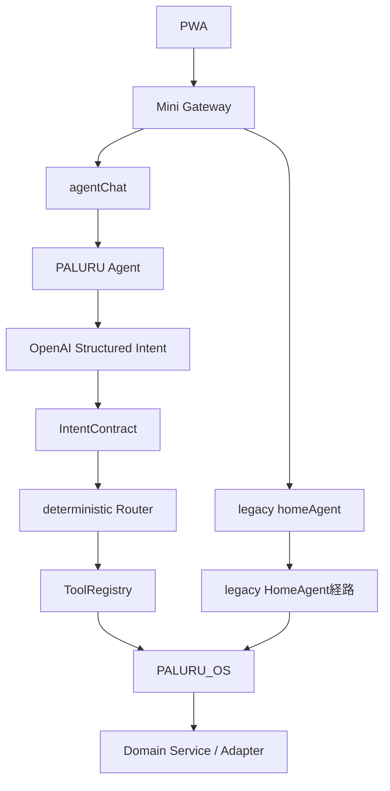
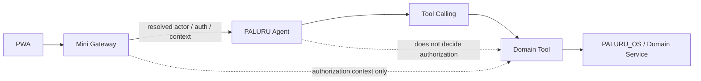
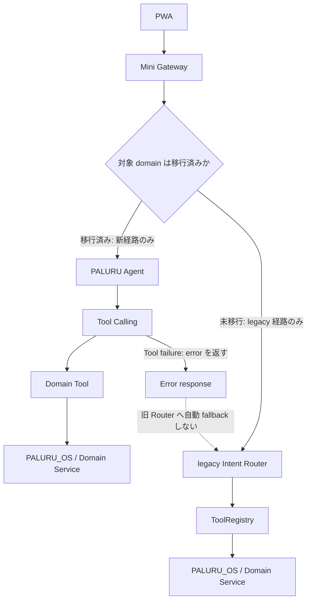

# Architecture

## 全体構成

PALURU Miniは、GitHub Pagesで配信するPWA、GAS Web App、Spreadsheet、OpenAI API、Google Calendarで構成します。

```text
PWA / GitHub Pages
        ↓
GAS Web App
        ↓
Spreadsheet 01_Inbox
        ↓
OpenAI Responses API
        ↓
Google Calendar
```

SignageはPALURUのInboxではなくGoogleカレンダーを参照します。

## データ正本

- 未処理の作業: PALURU Inbox
- 確定した予定: Googleカレンダー
- 処理済み履歴: Spreadsheetのcompleted行
- Signage表示: Googleカレンダー

eventはGoogleカレンダー登録成功後のみcompletedへ移動します。登録失敗時はInboxに残します。

## 外部連携

### OpenAI

GASからOpenAI Responses APIを呼びます。APIキーはScript Propertiesの `OPENAI_API_KEY` に保存します。

### Google Calendar

GASからCalendarAppで登録します。ファミリーカレンダーIDはScript Propertiesの `PALURU_FAMILY_CALENDAR_ID` に保存します。Calendar IDはフロントへ返しません。

## 状態遷移

### Inbox item

```text
inbox → completed
inbox → deleted
```

eventはGoogleカレンダー登録成功時のみ `completed` へ移動します。

### calendarSyncStatus

```text
not_required
pending
synced
failed
update_required
deleted
```

v1.0では新規登録と登録済み表示を主導線とします。GoogleカレンダーからPALURUへの逆同期は未実装です。

## PWA更新方針

- navigation / HTML / JS / CSS / manifest: network first
- 画像・キャラクター素材: cache first
- `updateViaCache: "none"`
- 起動時に `registration.update()`
- install時に `skipWaiting()`
- activate時に `clients.claim()`
- 古いcacheはactivateで削除
- controllerchange時は一度だけreload

## Current Architecture

本章は、Agent の相談・操作経路における現行構成を示します。前述の全体構成、データ正本、外部連携および PWA 更新方針は引き続き有効です。

`agentChat` と legacy `homeAgent` は並存しています。`agentChat` は Structured Intent を生成してから決定論的にルーティングする経路であり、`homeAgent` は legacy HomeAgent 経路として維持されています。



## Target Architecture

ADR-001 に基づく移行先の相談・操作経路は次のとおりです。

- Agent は自然言語理解、Tool 選択、multi-tool orchestration、結果統合、follow-up を担当する。
- actor / auth / context は Mini Gateway 側で解決する。Agent は authorization を決定しない。
- business rule / validation / cache / rate limit / idempotency / audit / write safety は、Domain Tool と PALURU_OS / Domain Service 側の決定論コードに残す。



## Read / Write Architecture

Read Tool は Agent から直接利用できます。ただし、Read 結果の business rule、validation、authorization、cache、rate limit、audit は Domain Tool と PALURU_OS / Domain Service が決定論的に実施します。

Migrated runtime は、Read execution と Write prepare execution を分離します。server-side Tool registryは各Toolを `read` または `write_prepare` に固定分類し、選択結果を対応するallowlistへだけdispatchします。Write ToolをMigrated Read Tool Poolへ混在させません。

```text
Agent selection
├─ zero Tool → natural response / safe follow-up
├─ Read Tool → Migrated Read Tool Calling
└─ Write prepare Tool → Migrated Write Prepare Tool Calling
                         → deterministic validation
                         → confirmation state creation
                         → CONFIRMATION_READY
```

PWA regex、hard-coded keyword、追加のlegacy Intentでこの分岐を行いません。migration ownership metadataは利用可能なcatalogを有効化するだけで、特定Toolの強制、authorization、capability決定、引数補完には使いません。AI selectorはToolを選べますが、Tool区分、認可、execute可否は決めません。

Write は、必ず次の三段階で実施します。

```text
prepare → confirmation → execute
```

- `prepare` は書込み候補と確認に必要な情報を生成する。
- `confirmation` は利用者の明示確認を記録する。
- `execute` は confirmation 後に actor / auth / context を再検証し、Tool / OS 側で validation、idempotency、write safety、audit を実施してから実行する。
- Agent の Tool Calling だけで実操作を完結させない。
- 既存 Aircon の `prepare / confirm / execute` は、この安全境界の実装資産として再利用する。

Write prepare runtimeは、1 user requestにつき `model calls <= 1`、`Tool calls <= 1`、`prepare calls <= 1`、`execute calls = 0` とします。複数の独立write、readとwriteの混在、複数write Tool callを選択結果が含む場合は、いずれも実行せず1件ずつ処理するためのfollow-upへ戻します。

## Command-aware Confirmation Architecture

confirmationの共通envelopeは次を正本とします。

```json
{
  "required": true,
  "confirmationId": "uuid",
  "command": "pet.health.record",
  "subject": {
    "kind": "pet",
    "id": "popio",
    "label": "ぽぴお"
  },
  "summary": "朝ごはん20g・完食で記録する",
  "expiresAt": "2026-08-19T10:05:00+09:00"
}
```

`subject`は対象表示用の構造化値であり、認可根拠ではありません。`summary`はDomain / OSの決定的テンプレートで生成し、model出力を正本にしません。

### Home compatibility

既存Home responseの `required`、`confirmationId`、`command`、`roomLabel`、`summary`、`expiresAt` は削除・renameしません。Home commandでは次の加算的mappingを許可します。

```json
{
  "roomLabel": "リビング",
  "subject": {
    "kind": "room",
    "id": "living",
    "label": "リビング"
  }
}
```

既存pending stateに`subject`がない場合は、server-side compatibility adapterが保存済みcanonical `roomId`から生成します。client値から`subject.id`を再構成しません。移行中は`roomLabel`と`subject.label`を同時に返し、不一致はfail closedとします。Pet Healthは`subject.kind = pet`を必須とし、`roomLabel`へ偽装しません。

### Confirmation trust boundary

```text
confirmationId + clientRequestId
→ server-side prepared state復元
→ actor再resolve
→ same home / member / device検証
→ command registryでrequired capability解決
→ capability再検証
→ execute
→ Domain Service
```

- confirm requestからbusiness payloadと`command`を再送させて正本にしません。
- confirmation stateには `homeId`、`memberUserId`、`deviceId`、`command`、normalized prepared payload、`createdAt`、`expiresAt`、idempotency情報をbindします。
- TTLはHome/Petとも5分です。期限切れは `CONFIRMATION_EXPIRED` とし、executeしません。
- 同じconfirmationの再confirmはorchestration層で同じ結果を返します。Domain Serviceは別途`clientRequestId`でbusiness writeの重複を防ぎます。

### Command capability registry

commandからrequired capabilityへのmappingはserver-side fixed registryを唯一の正本とします。AI、PWA、confirm requestはcapabilityを指定しません。

| command | required capability |
| --- | --- |
| `automation.pause` | `home.control` |
| `automation.resume` | `home.control` |
| `aircon.power` | `home.control` |
| `aircon.applySettings` | `home.control` |
| `pet.health.record` | `pet.health.record` |

Home commandのroom validation、`home.control`、5分TTL、actor / home / device再検証は現状より弱めません。

Pet Healthは家族共有領域とし、server-resolved active memberへ次を付与する設計とします。role名そのものでは許可せず、実行時はTrustedContext上のcapabilityを検証します。

| role | `pet.health.read` | `pet.health.record` |
| --- | --- | --- |
| `admin` | yes | yes |
| `guardian` | yes | yes |
| `self_record` | yes | yes |

## Migration Architecture

Big Bang での置換は行いません。domain ごとに新旧経路を切り替え、未移行 domain のみ legacy Router を利用します。同一 request で新旧経路を二重実行しません。

Tool の失敗時は失敗を呼出し元へ返します。旧 Router への自動 fallback は行いません。



## Phase 1

Phase 1 は次の順序で導入範囲を限定します。

1. Weather read
2. Calendar read
3. Home read
4. Calendar + Weather multi-tool
5. Home `prepareAction`

`prepareAction` 後の confirmation と execute は、既存 Aircon の `prepare / confirm / execute` を再利用する前提で、別途設計・検証します。

## Phase 2 — Pet Health Read / Write Prepare

Phase 1は対象Toolを限定して閉じたmigration phaseであるため、Pet Healthを欠番のPhase 1 subphaseへ推測で追加しません。Pet Healthは新しいtop-level migration phaseであるPhase 2として導入します。

Phase 2の責務は次のとおりです。

1. `pet.health.getDailySummary` をside effectなしのRead Toolとして提供する。
2. `pet.health.record` をprepare-only Write Toolとして提供する。
3. command-aware confirmationを使い、`pet.health.record` capabilityをconfirm時に再検証する。
4. confirmation後の別requestだけがPet Health Domain Serviceをexecuteする。

Pet Healthはlegacy Intent Contract / Routerへ追加しません。Tool Calling経路で失敗したPet Health requestをlegacyへfallbackせず、同一requestで新旧経路を二重実行しません。Phase 1のRead/Home contractとmulti-tool coverageは変更しません。

### Pet Health physical storage

Human HealthとPet Healthは論理Domain、namespace、schema、service、authorizationを分離します。MVPの物理保存先は **Option A: 既存Health Spreadsheet内の専用Sheet** とします。

| 比較軸 | Option A: 既存Health Spreadsheet内 | Option B: Pet専用Spreadsheet |
| --- | --- | --- |
| secret / property追加 | 既存Health transportを利用でき、追加を抑えられる | `PET_HEALTH_SPREADSHEET_ID`等の追加管理が必要 |
| GAS運用数 | 既存Health GAS deployment内で論理serviceを分離できる | 専用GASにするとdeploy・監視対象が増える |
| backup / restore | 同一backup単位。Pet単独restoreは難しい | Pet単独backup・restoreが容易 |
| 障害影響 | Spreadsheet/GAS障害がHuman/Pet双方へ及ぶ | 物理障害の影響を分離しやすい |
| schema責務 | Sheetとserviceを分ければ列衝突を防げる | 物理的にも責務が明確 |
| 将来拡張 | 論理contractを維持して後から分離可能 | Pet device連携等を独立拡張しやすい |
| MVP運用負荷 | 小さい | property、権限、deploy、backup運用が増える |

MVPでは運用対象とsecret/propertyを増やさない利点を優先します。正本Sheetは `Pet_Health_Events` と `Pet_Health_Request_Log` とし、Human Healthの `Health_Daily`、`Health_Weight`、`Health_Request_Log` へPet列を追加しません。Pet serviceはHuman slot serviceを呼ばず、`targetUserId`を使用しません。将来Option Bへ移す場合もPet Health API contractを変更しないmigrationとします。

### Phase 2 observability

候補stageは次のとおりです。

```text
TOOL_SELECTION
WRITE_PREPARE
CONFIRMATION_READY
CONFIRMATION_RECEIVED
ACTOR_REVALIDATED
COMMAND_AUTHORIZED
WRITE_EXECUTE
WRITE_COMPLETED
```

既存Traceの汎用 `event` / `stage`、call count、elapsed、`toolNames`、`executionPath`、`resultStatus`で表現できるため、Phase 2 ArchitectureではTrace headerを追加しません。実装時は既存append-only schemaとDTO preservation contractを維持します。健康内容、note、raw payload、Calendar、Inbox、token、secretをTraceへ保存しません。

## Deferred Domains

次の domain はPhase 1の対象外です。Human Healthとその他の未移行domainはlegacy経路を維持します。Pet HealthだけはPhase 2で新しいTool Calling型domainとして導入し、legacy Intentへ追加しません。

- Human Health
- Pet Health（Phase 2で移行。legacy追加なし）
- Finance
- Energy
- School / Lunch などの legacy domain
