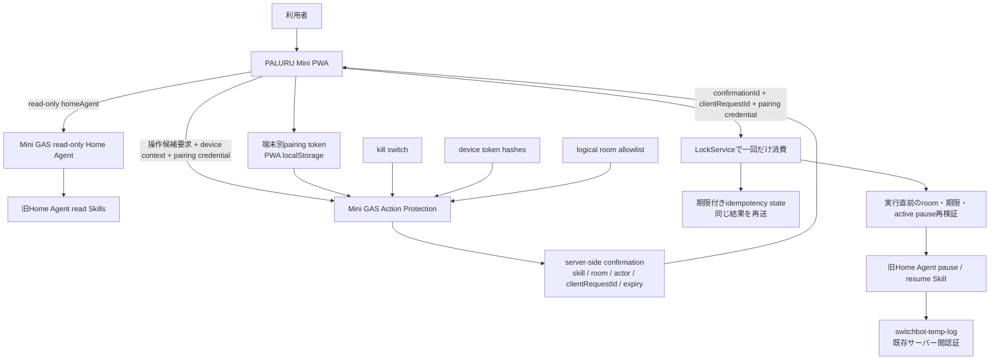

# Home Agent Climate Slice

## Scope

This slice connects PALURU Mini Home Agent climate intents to the actual `switchbot-temp-log` GAS project.

Implemented now:

- read latest room temperature and humidity from `Log`
- read notable room climate alerts from actual `ROOM_CONFIG` and latest logs
- read active room automation pause from `Aircon_Override`
- create a room automation pause only after user confirmation
- resume room automation only after user confirmation

Still not connected:

- actual aircon temperature/mode changes
- `executeAirconAction`
- `sendAirconSetAll`
- `sendAirconOff`

## Source Of Truth

The source of truth is:

`HomeSignage/gas-projects/switchbot-temp-log`

Data sources:

- temperature and humidity: `Log`
- room configuration and thresholds: `ROOM_CONFIG`
- aircon state: `Aircon_State`
- pause state: `Aircon_Override`

PALURU Mini does not keep a separate room master for climate control. It calls the switchbot-temp-log Web App and displays the returned data.

## Script Properties

PALURU Mini GAS:

- `SWITCHBOT_TEMP_LOG_WEB_APP_URL`: switchbot-temp-log Web App URL
- `PALURU_HOME_AGENT_SECRET`: shared secret for every Home Agent action request

switchbot-temp-log GAS:

- `PALURU_HOME_AGENT_SECRET`: same shared secret

The secret is sent only from PALURU GAS to switchbot-temp-log GAS. It is required for both read and write actions and is not stored in the front end.

PALURU Mini action-protection properties:

- `PALURU_HOME_AGENT_ACTIONS_ENABLED`: operation kill switch; only explicit `true` enables actions
- `PALURU_HOME_AGENT_DEVICE_TOKEN_HASHES`: paired `deviceId` to SHA-256 token-hash mapping
- `PALURU_HOME_AGENT_ALLOWED_ROOM_IDS`: allowlisted logical room IDs

Values are operational secrets or environment configuration and must not be documented in the repository. Deployment, rotation and rollback procedures are maintained in [Home Agent Action Operations](home-agent-action-operations.md).

## switchbot-temp-log Actions

Read-only actions:

- `getRoomClimate`
- `getRoomClimateAlerts`
- `getRoomAutomationPause`
- `buildPauseRoomAutomationProposal`

Write actions also requiring confirmation:

- `pauseRoomAutomation`
- `resumeRoomAutomation`

All action requests require `PALURU_HOME_AGENT_SECRET`. Responses are sanitized. Device IDs, tokens, spreadsheet IDs, and internal secrets are not returned.

## Intents

- `room_climate_check`: read one room
- `room_climate_alert_check`: scan rooms and return only notable rooms
- `aircon_override_request`: build an aircon adjustment proposal only
- `pause_room_automation`: build a pause proposal, then create pause after confirmation
- `resume_room_automation`: build a resume proposal, then resume after confirmation

## Skills

PALURU Mini skills now wrap switchbot-temp-log:

- `getRoomClimate`
- `getAllRoomClimateAlerts`
- `getAirconStatus`
- `getRoomAutomationPause`
- `buildPauseRoomAutomationProposal`
- `pauseRoomAutomation`
- `resumeRoomAutomation`

`buildAirconAdjustmentProposal` remains proposal-only and does not call actual SwitchBot operations.

## Read Flow

1. Front end sends `action=homeAgent` to PALURU Mini GAS.
2. PALURU Home Agent detects the climate intent.
3. PALURU GAS calls `SWITCHBOT_TEMP_LOG_WEB_APP_URL` server-to-server.
4. switchbot-temp-log reads `Log`, `ROOM_CONFIG`, `Aircon_State`, and `Aircon_Override`.
5. PALURU displays the sanitized result.

## Pause Lifecycle

1. User asks to stop automation.
2. PALURU GAS validates the kill switch, paired device and server-side room allowlist.
3. PALURU GAS stores the bound operation and returns a five-minute `confirmationId` without returning mutable operation parameters.
4. Front end shows a confirmation panel.
5. User confirms; the PWA sends only the confirmation identifiers plus its pairing credential, not skill/room/duration/`confirmed=true`.
6. PALURU GAS consumes the confirmation atomically with `LockService`, revalidates state and input, then calls switchbot-temp-log `pauseRoomAutomation` with the server-side shared secret.
7. switchbot-temp-log writes `Aircon_Override`.
8. PALURU stores the sanitized result in bounded, expiring internal Script Properties for idempotent retries and shows the active pause.

Resume follows the same confirmation path and calls `resumeRoomAutomation`.

The public Web App remains anonymous. Device pairing is a bearer-token mitigation, not human identity authentication. Missing configuration fails closed, and `PALURU_HOME_AGENT_ACTIONS_ENABLED` is the operational kill switch.

## Operation Security Architecture



### Security boundaries and decisions

- Pairing protects the caller possession boundary. It does not prove the human identity behind the device.
- Confirmation protects operation integrity and replay. It is not authentication by itself.
- The PWA never resends mutable skill, room or duration fields when confirming an operation.
- The kill switch is checked before issuance and execution, so missing configuration fails closed without affecting read-only `homeAgent`.
- The room allowlist contains logical room IDs only. Physical device IDs are never accepted from the browser.
- `clientRequestId` and the consumed confirmation result prevent an ordinary retry from creating another pause row.
- Resume is bound to the active pause observed when the confirmation was issued. A changed target is rejected immediately before execution.
- The existing Mini-to-switchbot shared secret remains a separate server-to-server boundary and is never sent to the PWA.
- `setAirconOverride` and other unconnected operations remain rejected.

## Freshness

switchbot-temp-log treats sensor data older than 15 minutes as `stale`.
PALURU may show stale data but must not create strong operation proposals from stale sensor data.

## Alerts

`getRoomClimateAlerts` returns only notable rooms, up to 3 items, with:

- `roomId`
- `displayName`
- `severity`
- `reason`
- `message`
- `measuredAt`
- `suggestedActions`

No push, Signage, or LINE notification is sent automatically.

## Safety

- No front-end direct call to switchbot-temp-log.
- No shared secret in front-end JavaScript.
- Read actions and write actions are separated.
- Every action request requires the shared secret.
- Mini action issuance requires the kill switch, paired device and logical room allowlist.
- Write confirmation uses a server-bound, five-minute confirmation rather than trusting client-supplied `confirmed=true` or action parameters.
- `LockService`, idempotency state and immediate state revalidation protect retries and state changes.
- Actual aircon operations are not connected in this slice.
- Safety-off behavior remains under switchbot-temp-log control.

## Tests To Run In GAS

switchbot-temp-log Web App payload examples:

```json
{ "action": "getRoomClimate", "roomId": "bedroom" }
```

```json
{ "action": "getRoomClimateAlerts" }
```

```json
{
  "action": "pauseRoomAutomation",
  "roomId": "bedroom",
  "confirmed": true,
  "expiresAt": "2026-07-13 06:00:00",
  "secret": "<Script Property value>"
}
```

PALURU Mini front-end checks:

- `寝室暑い？` returns one room only.
- `暑い部屋ある？` returns only notable rooms.
- `寝室の自動制御を2時間止めて` shows a confirmation panel.
- Confirming pause creates an active `Aircon_Override` row.
- `通常運転に戻して` cancels active pause after confirmation.
